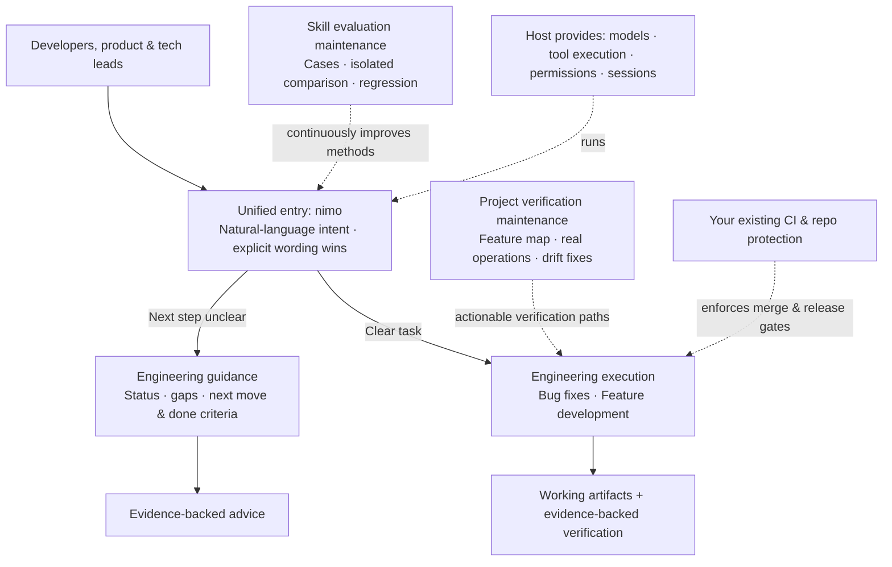

[中文](./README.md) | English

# nimo

**An AI-native engineering stack.** Ships as an installable Skill package that plugs into the AI coding tools you already use. One entry point, two ways of working: when you know what to do, nimo executes; when you don't, it reads your project's current state and recommends the next move — with evidence.

nimo does not provide the model or run the tools — the host does. What nimo provides is engineering discipline: principles, task playbooks, replaceable engineering capabilities, real verification, and continuous improvement, judging completion by artifacts and evidence.

## Quick Start

Prerequisite: Codex CLI 0.144 or later.

```powershell
# Windows (PowerShell)
git clone https://github.com/ttttstc/nimo.git
cd nimo
.\integrations\codex\install.ps1
```

```bash
# macOS / Linux
git clone https://github.com/ttttstc/nimo.git
cd nimo
./integrations/codex/install.sh
```

The installer writes only nimo-owned files under `CODEX_HOME/skills` and tracks ownership in a manifest — it never touches your other configuration. Isolated test installs and clean uninstalls (`uninstall.ps1` / `uninstall.sh`) are supported.

Claude Code integration works the same way — see [integrations/claude-code/README.md](integrations/claude-code/README.md) (writes to `CLAUDE_CONFIG_DIR/skills`, default `~/.claude/skills`).

After installing, make your first call in any project directory:

```text
codex exec "Use the nimo skill: look at this project and advise how to proceed. Discuss only — do not modify any files."
```

Expected: current status, main gaps, the priority action, and the definition of done — and the "discuss first" phase modifies no files (verify with `git status`). See [integrations/codex/README.md](integrations/codex/README.md) for more options.

## The Big Picture



Day-to-day usage is plain language:

```text
$nimo How should we push this requirement forward?
$nimo Check what's missing from the login design — don't implement yet.
$nimo Fix the endless loading after login. Reproduce it and verify.
$nimo Implement project list filtering, keeping the existing API compatible.
```

nimo honors explicit wording like "discuss first", "don't modify", and "start implementing". "Continue" only picks up the most recent concrete proposal — it never silently expands scope.

## Capability Boundaries

**What v1 does:** engineering guidance, bug fixes, and feature development — plus the project verification maintenance and Skill evaluation maintenance that support them.

**What it does not do (boundaries):**

- No self-built agent runtime, workflow engine, standalone task platform, long-term memory system, or generic plugin SDK — model calls, tool execution, permissions, and sessions come from the host.

- Does not replace your project's enforced gates — merges and releases are enforced by your CI and repo protection. nimo's completion checks don't bypass them, and prompts are not a security sandbox.

- No long-term multi-project orchestration or automated merge/release queues — performance work, dedicated refactoring, and similar concerns may become later playbooks; they are not part of v1.

- Never auto-installs unfamiliar Skills or pulls unreviewed scripts — it only uses capabilities visible in the current environment or registered by the project.

- When the host lacks a capability (no parallelism, no isolated contexts, no product-driving tools), nimo degrades honestly or reports blockage — it never reports aspirations as results.

## Capability Status

All capabilities planned for v1 are in place:

| Capability              | Coverage                                                                                                           | Details                                                                                                                    |
| ----------------------- | ------------------------------------------------------------------------------------------------------------------ | -------------------------------------------------------------------------------------------------------------------------- |
| Unified entry           | guidance/execution intent, explicit wording wins, scope-acceptance rules                                           | [skills/nimo-mode](skills/nimo-mode/SKILL.md)                                                                              |
| Engineering methods     | principles index, Bug/Feature playbooks                                                                            | [skills/nimo-mode](skills/nimo-mode/SKILL.md)                                                                              |
| Sub-agent collaboration | six-part task contracts, launch specs, acceptance & stop rules, checkpoints & recovery                             | [issue-3 record](docs/evidence/issue-3/README.md)                                                                          |
| Host integrations       | install, update & uninstall for Codex and Claude Code                                                              | [integrations](integrations/codex/README.md), [Claude Code](integrations/claude-code/README.md)                            |
| Project verification    | feature-map init, patrol maintenance, three-way triage of doc drift / tooling gaps / product defects               | [verification-create](skills/nimo-verification-create/SKILL.md), [verification-maintain](skills/nimo-verification-maintain/SKILL.md) |
| Skill evaluation        | eval cases, scoring rubric, isolated baseline/candidate comparison, deterministic assertions & independent judging | [skill-evaluate](skills/nimo-skill-evaluate/SKILL.md), [evals](evals/README.md)                                           |

Actual execution records and verification evidence are archived per issue under [docs/evidence/](docs/evidence/); unverified scopes and known limitations are stated in those records.

## Repository Tour

```text
skills/          nimo entry, setup detection, project verification & evaluation Skills
integrations/    Thin host integrations (Codex, Claude Code)
evals/           Evaluation cases, scoring rubric, and run records
docs/            Overall design document and verification evidence
```

## Learn More

- [nimo overall design](docs/nimo-overall-design.md): architecture, user paths, feature maps, evaluation maintenance, and acceptance requirements

- [Codex integration guide](integrations/codex/README.md) / [Claude Code integration guide](integrations/claude-code/README.md): install, isolated testing, update, and uninstall

- [Evaluation methodology](evals/README.md): case organization, isolated execution, and scoring

