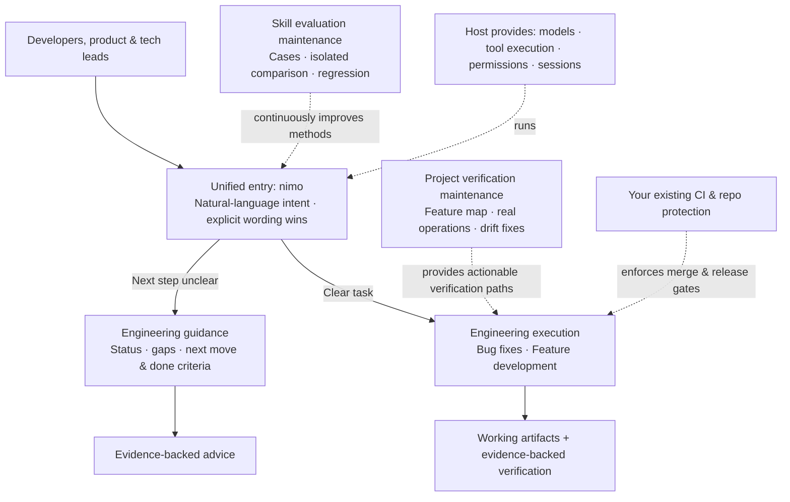

[中文](./README.md) | English

# nimo

i maintain nimo. over the past year i've watched people hand more and more work to agents: writing faster, verifying less, shipping something closer to a lottery draw. i don't accept throughput as a substitute for quality. if you want to go fast, go deep first.

**nimo is my answer.** it runs no models and executes no tools — that's the host's job (Codex, Claude Code). nimo is the engineering discipline itself: principles, task playbooks, replaceable engineering capabilities, real verification, continuous improvement. the goal is not to maximize loc. it's the opposite: **nimo helps you write less, but every line comes with evidence.**

**nimo gives you auditable delivery.** every conclusion is anchored to artifacts and evidence: unverified is labeled unverified, missing conditions are reported as blockers, skipped checks are marked as skipped. a sub-agent saying "done" doesn't count; it counts when the main agent has verified it.

**swap anything, keep the standards.** swap the model, the host, or an engineering skill — task goals, engineering requirements, and delivery standards stay the same. swap a skill and only the capability layer changes; swap the host and only the runtime changes.

fork it. improve it. make it yours. PRs are welcome!

## install

prerequisite: Codex CLI 0.144+ or Claude Code 2.0.20+.

```powershell
# Windows (PowerShell)
git clone https://github.com/ttttstc/nimo.git
cd nimo
.\integrations\codex\install.ps1          # Codex
.\integrations\claude-code\install.ps1    # Claude Code
```

```bash
# macOS / Linux
git clone https://github.com/ttttstc/nimo.git
cd nimo
./integrations/codex/install.sh           # Codex
./integrations/claude-code/install.sh     # Claude Code
```

the installer writes only nimo-owned files, tracks ownership in a manifest, and never touches your other configuration. uninstall is clean, and isolated test installs can be re-run any time.

## get started

two steps:

1. install (done above).
2. in any project directory, say:

```text
codex exec "Use the nimo skill: look at this project and advise how to proceed. Discuss only — do not modify any files."
```

that's it. expect: current status, main gaps, the priority action, and the definition of done — and the "discuss first" phase modifies no files (verify with `git status`). the other skills are situational; the mode skill uses them for you as needed.

## usage

use the unified entry at the start of a task. it reads your request, picks from a set of playbooks, and runs the other skills as the steps need them.

### just use `nimo`

```text
$nimo How should we push this requirement forward?

$nimo Fix the endless loading after login. Reproduce it and verify.

$nimo Implement project list filtering, keeping the existing API compatible.
```

when invoked it:

1. classifies intent: guidance or execution. if unclear, defaults to guidance — no side effects.
2. matches a playbook and copies its steps verbatim; recommended steps may be reordered per task, required checks cannot be silently skipped.
3. runs skills per step; non-trivial implementations are delegated to sub-agents with full task contracts, verified by the main agent.
4. delivers evidence-backed conclusions: pass, fail, or unverified — each stated explicitly.

explicit wording always wins over inference: "discuss first" and "don't modify" mean read-only; "continue" only picks up the most recent concrete proposal — it never silently expands scope; "stop" means stop and save the checkpoint. full rules in [skills/nimo-mode/SKILL.md](skills/nimo-mode/SKILL.md).

### main flow

how a task goes from your message to delivery:

```mermaid
flowchart TB
    S[You say something] --> I{Entry classifies intent}
    I -->|Unclear / just talking| G[Treat as guidance<br/>read-only, no side effects]
    I -->|Clear task| P[Match a playbook<br/>copy steps, reorder per task<br/>required checks cannot be skipped]
    G --> OUT1[Output: status · gaps · priority action · done criteria]
    P --> D{Simple or complex}
    D -->|Simple implementation| M[Main agent does it directly]
    D -->|Non-trivial implementation| SUB[Delegate to a sub-agent<br/>with a full task contract: goal · boundaries · deliverables · acceptance · stop rules]
    SUB --> CHK[Main agent verifies<br/>sub-agent's "done" doesn't count until checked]
    M --> V[Verify: real user paths<br/>no loosened expectations]
    CHK --> V
    V --> OUT2[Deliver: pass / fail / unverified<br/>each stated explicitly, with evidence]
```

key points:

1. if intent is unclear, treat it as guidance — no side effects.
2. non-trivial implementations are delegated to sub-agents; the main agent verifies.
3. conclusions come in exactly three kinds: pass, fail, unverified — unverified is labeled unverified, missing conditions are reported as blockers.

### playbooks

| playbook                                                             | for                                                                                                         |
| -------------------------------------------------------------------- | ----------------------------------------------------------------------------------------------------------- |
| [feature](skills/nimo-mode/playbooks/feature.md)                     | new or changed behavior, starting from explicit acceptance criteria, verified before delivery.              |
| [bug-fix](skills/nimo-mode/playbooks/bug-fix.md)                     | reproduce a defect, preserve failure evidence, root-cause, minimal fix, before/after diff.                  |
| [investigation](skills/nimo-mode/playbooks/investigation.md)         | read-only understanding: how does X work, why was Y built this way, are we sure.                            |
| [refactoring](skills/nimo-mode/playbooks/refactoring.md)             | behavior-preserving change to structure or shape.                                                           |
| [prototype](skills/nimo-mode/playbooks/prototype.md)                 | cheap experiment to answer a design question, or parallel comparison before committing.                     |
| [perf-issue](skills/nimo-mode/playbooks/perf-issue.md)               | one performance issue: locate, measure, improve, compare against baseline.                                  |
| [hillclimb](skills/nimo-mode/playbooks/hillclimb.md)                 | sustained scientific improvement of one metric: hypothesis loop, before/after, one commit per accepted win. |
| [runtime-forensics](skills/nimo-mode/playbooks/runtime-forensics.md) | diagnose a live symptom (leak, idle-cpu spin, glitch) from instrumentation.                                 |
| [trace-forensics](skills/nimo-mode/playbooks/trace-forensics.md)     | diagnose a captured profiling artifact (cpuprofile, trace, heap snapshot).                                  |
| [visual-parity](skills/nimo-mode/playbooks/visual-parity.md)         | pixel-exact UI equivalence between two implementations.                                                     |
| [authoring-a-skill](skills/nimo-mode/playbooks/authoring-a-skill.md) | writing or editing a SKILL.md.                                                                              |
| [eval](skills/nimo-mode/playbooks/eval.md)                           | test how a skill or prompt change affects agent behavior, blinded.                                          |
| [babysit](skills/nimo-mode/playbooks/babysit.md)                     | drive a PR to merge-ready: conflicts, review threads, CI.                                                   |
| [shipping](skills/nimo-mode/playbooks/shipping.md)                   | independently verify a green stack, then land the contiguous verified run bottom-up.                        |
| [autonomous-run](skills/nimo-mode/playbooks/autonomous-run.md)       | drive a long task to completion without stopping.                                                           |
| [orchestrate](skills/nimo-mode/playbooks/orchestrate.md)             | a standing project handed to one coordinator: multi-day, many stacked PRs, fleets of subagents.             |
| [autopilot-full](skills/nimo-mode/playbooks/autopilot-full.md)       | run independent PRs to merged with one owner per PR and root verification of each head.                     |
| [autopilot-stack](skills/nimo-mode/playbooks/autopilot-stack.md)     | build and verify one linear base-branch stack for the operator to review and land.                          |
| [session-pickup](skills/nimo-mode/playbooks/session-pickup.md)       | resume or take over a prior agent's in-flight work.                                                         |
| [pause-safely](skills/nimo-mode/playbooks/pause-safely.md)           | suspend in-flight work cleanly so it can be resumed later.                                                  |
| [multi-phase-plan](skills/nimo-mode/playbooks/multi-phase-plan.md)   | work that spans phases or stacked PRs.                                                                      |
| [worktree-cleanup](skills/nimo-mode/playbooks/worktree-cleanup.md)   | reclaim disk by pruning merged or abandoned worktrees, safety-gated.                                        |
| [opening-a-pr](skills/nimo-mode/playbooks/opening-a-pr.md)           | open a ready PR from small ordered commits. invoked at the end of every other playbook.                     |

### examples

```
bug fix:           $nimo this PR has a subtle bug where the scroll drifts every 750ms even
                   when idle. repro first, then fix and verify.

perf:              $nimo a big list takes a second or two to load even though we virtualize.
                   run a CPU trace and tell me why.

feature:           $nimo build a small feature behind a feature flag. verify it really works.

prototype:         $nimo build two prototypes of the markdown renderer so we can compare.
                   spawn an agent for each.

overnight run:     $nimo i'm going to bed. land the stack even if CI flakes. i want
                   everything merged by morning.

babysit:           $nimo check on PR 123. anything outstanding?

visual parity:     $nimo the row spacing is too tall when this flag is on. the second image
                   is correct. repro and fix until it matches.

figure it out:     $nimo i'm stepping away. migrate every caller from the synchronous store
                   to the new async one, keeping behavior identical. i want to trust it was done
                   right when i'm back.

how:               $how do we cancel runs? do we have an N+1 when we look up every run to cancel?

why:               $why is this feature flag not on yet?

architect:         design this instrumentation to be high signal with no false positives.
                   /architect this first.

arena:             $arena take my prompt to the arena verbatim. i want to compare their proposals
                   with yours.

swarm:             $swarm check every package under packages/ against its check.sh. one worker per
                   package. one report.

interrogate:       $interrogate review this PR.

tdd:               $tdd implement

unslop:            can we unslop and tighten the new changes?

reflect:           $reflect that took too long. capture what we learned so the next run doesn't
                   repeat it.

show-me-your-work: $show-me-your-work keep a decision trail i can review when i'm back.

```

## skills

`nimo-mode` runs most of these for you when a step needs them (`how`, `why`, `architect`, `arena`, `swarm`, `interrogate`, `unslop`, `no-comments`, `technical-writing`, `tdd`, and the principles). the table below is for when you want one directly:

| skill                                                                    | use it when                                                                                                                                |
| ------------------------------------------------------------------------ | ------------------------------------------------------------------------------------------------------------------------------------------ |
| [nimo-mode](skills/nimo-mode/SKILL.md)                                   | default entry point for any non-trivial task.                                                                                              |
| [nimo-how](skills/nimo-how/SKILL.md)                                     | you want a walkthrough of how a subsystem works.                                                                                           |
| [nimo-why](skills/nimo-why/SKILL.md)                                     | you want to know why something was built this way. discovers seven evidence categories at run time and queries each in parallel.           |
| [nimo-architect](skills/nimo-architect/SKILL.md)                         | you're about to write code that crosses a function boundary and want the caller's usage, types, and module shape settled first.            |
| [nimo-arena](skills/nimo-arena/SKILL.md)                                 | you want N parallel attempts at the same thing, then to grab the best parts of each.                                                       |
| [nimo-swarm](skills/nimo-swarm/SKILL.md)                                 | you want N parallel workers across different slices or races, then one aggregated report.                                                  |
| [nimo-interrogate](skills/nimo-interrogate/SKILL.md)                     | you have a diff and want several different models to try to break it, including a strict code-quality lens.                                |
| [nimo-figure-it-out](skills/nimo-figure-it-out/SKILL.md)                 | no bundled playbook fits. designs a rigorous, auditable playbook for the task (large migrations, multi-part changes).                      |
| [nimo-tdd](skills/nimo-tdd/SKILL.md)                                     | you're fixing a bug and there's a cheap local test path. write the failing test first, then the fix.                                       |
| [nimo-verify](skills/nimo-verify/SKILL.md)                               | post-implementation / regression / pre-merge / pre-ship verification — real user paths, no loosened expectations.                          |
| [nimo-deslop](skills/nimo-deslop/SKILL.md)                               | pre-commit cleanup of the current diff: narrative comments, dead compat paths, unrelated changes.                                          |
| [nimo-unslop](skills/nimo-unslop/SKILL.md)                               | remove AI tells from any writing and put back the human voice.                                                                             |
| [nimo-no-comments](skills/nimo-no-comments/SKILL.md)                     | clean up / review comments; prefer encoding constraints as types / runtime checks / tests / CI.                                            |
| [nimo-show-me-your-work](skills/nimo-show-me-your-work/SKILL.md)         | long or unattended work, keep a reviewable decision trail (TSV log).                                                                       |
| [nimo-skill-author](skills/nimo-skill-author/SKILL.md)                   | create or edit a SKILL.md: write runnable, verifiable skills.                                                                              |
| [nimo-skill-evaluate](skills/nimo-skill-evaluate/SKILL.md)               | skill behavior evaluation and version comparison: blinded candidate run, isolated execution, scoring.                                      |
| [nimo-technical-writing](skills/nimo-technical-writing/SKILL.md)         | layered doc standard (Diátaxis + Google developer style + STE + Global English) for docs, RFCs, readmes, PR descriptions, commit messages. |
| [nimo-verification-create](skills/nimo-verification-create/SKILL.md)     | your project has no scripted way to prove app behavior. generates a project-local verify skill with a feature map.                         |
| [nimo-verification-maintain](skills/nimo-verification-maintain/SKILL.md) | your verify skill's feature map has drifted from the app. source wave + one live pass, three-way triage.                                   |
| [nimo-setup](skills/nimo-setup/SKILL.md)                                 | install detection and configuration: install, update, uninstall, capability detection.                                                     |
| [configure-nimo](skills/configure-nimo/SKILL.md)                         | add / remove / list / validate team and personal principles and knowledge sources.                                                         |

## where nimo sits



nimo is the engineering-method layer in the AI dev stack:

| layer                        | provided by                  | owns                                                                               |
| ---------------------------- | ---------------------------- | ---------------------------------------------------------------------------------- |
| model layer                  | LLM                          | reasoning                                                                          |
| agent runtime layer          | Codex / Claude Code / Cursor | model calls, tools, permissions, sessions, sub-agents                              |
| **engineering-method layer** | **nimo**                     | principles, playbooks, capability contracts, quality gates, evaluation maintenance |
| project asset layer          | your project `.nimo/`        | feature map, verification scripts, checkpoints                                     |
| enforcement layer            | your CI and repo protection  | mandatory merge and release gates                                                  |

nimo defines "what counts as done right and done complete"; the host executes; your CI is the final gate. nimo does not replace it.

## principles

twenty-one engineering principles, one per skill. `nimo-mode` indexes them inline and reads that index at task start. the standalone files are there so other skills can reference a principle by name, and so the index can point at the full rule for each.

| principle                                | rule                                                                                                                                              |
| ---------------------------------------- | ------------------------------------------------------------------------------------------------------------------------------------------------- |
| laziness-protocol                        | Bias toward deletion and the smallest change that solves the problem.                                                                             |
| foundational-thinking                    | Get the data structures right before writing logic so downstream code becomes obvious.                                                            |
| subtract-before-you-add                  | Remove dead weight, redundant validators, and stub references first, then build on the simpler base.                                              |
| minimize-reader-load                     | Count layers between question and answer, and hidden state in the reader's head; collapse one-caller wrappers and shrink mutable scope.           |
| outcome-oriented-execution               | Converge on the target architecture; don't preserve smooth intermediate states with throwaway compatibility code.                                 |
| experience-first                         | Choose user delight over implementation convenience; ship fewer polished features over more rough ones.                                           |
| exhaust-the-design-space                 | Build 2-3 competing prototypes and compare side by side before committing.                                                                        |
| build-the-lever                          | Build the tool that does it or proves it (codemod, script, generator, or a skill your subagents follow) instead of working by hand.               |
| redesign-from-first-principles           | Redesign as if the requirement had been a foundational assumption from day one, instead of bolting it on.                                         |
| model-the-domain                         | Encode the domain in a structure instead of scattered conditionals.                                                                               |
| boundary-discipline                      | Concentrate guards at system boundaries (CLI, config, network, external APIs); trust internal types and keep business logic in pure functions.    |
| type-system-discipline                   | Make illegal states unrepresentable, brand semantic primitives, parse external data at boundaries, derive from authoritative schemas.             |
| make-operations-idempotent               | Converge to the same end state regardless of partial prior runs.                                                                                  |
| prove-it-works                           | Verify against the real artifact (run the feature, read the actual value, inspect the diff), not a proxy, self-report, or 'it compiles.'.         |
| fix-root-causes                          | Trace each symptom to its root cause and fix it there; reproduce first, ask why until you reach it, resist nil-check guards that silence crashes. |
| sequence-verifiable-units                | Break work into small units that each end in a verifiable state, check each before the next, and order delivery so the sequence proves itself.    |
| guard-the-context-window                 | Route bulk to subagents; keep summaries in the main thread, not raw payloads.                                                                     |
| never-block-on-the-human                 | Proceed, present the result, let the human course-correct after the fact; reserve confirmation for irreversible actions.                          |
| encode-lessons-in-structure              | Encode the rule as a lint, metadata flag, runtime check, or script instead of more text.                                                          |
| separate-before-serializing-shared-state | Eliminate the sharing first; serialize structurally only when one shared writer is a real invariant.                                              |
| migrate-callers-then-delete-legacy-apis  | Migrate callers and delete the old API in the same wave instead of preserving compatibility layers.                                               |

full rules, applicability, and exceptions live in [skills/nimo-mode/SKILL.md](skills/nimo-mode/SKILL.md).

## not shipped here

- no self-built agent runtime, workflow engine, task platform, long-term memory, or plugin SDK. if the host has it, use the host's; if not, degrade honestly.

- no replacement for your CI and repo protection. completion checks are engineering requirements, not enforced gates — and prompts are not a security sandbox.

- no multi-project orchestration or automated merge/release queues. performance work and dedicated refactoring may come later; not in v1.

- never auto-installs unfamiliar skills or pulls unreviewed scripts. only capabilities visible in the environment or registered by the project.

- when the host lacks a capability (no parallelism, no isolated contexts, no product-driving tools), nimo reports the blockage instead of reporting aspirations as results.

## team & personal knowledge

no configuration needed to use the default methods. when you need external material, just say "add ./docs to project knowledge" or "add \~/knowledge to my personal knowledge".

project config is .nimo/nimo.yaml, personal config is \~/.nimo/nimo.yaml:

```yaml
principles:
  - skill: company-api-first
  - path: ./engineering/principles/reliability.md
knowledge:
  - ./docs
```

project-relative paths use the project root; personal-relative paths use the home directory. conversational paths are resolved from the current working directory before storage. references are additive and deduplicated; knowledge is searched on demand, never copied wholesale. "skip this source this time" affects the current session only.

## verified status

some run evidence is archived in this repo; the rest is retained locally per task. a few things that are actually true:

- ran live inside Claude Code 2.1.23: session attribution proves the skill was loaded, `git status` stayed clean after "discuss only," and the guidance output contained all four elements ([issue-8](docs/evidence/issue-8/real-invocation.log)).

- a feature-map maintenance patrol on a sample project genuinely caught documentation drift, a tooling gap, and a real product defect — the first two were fixed and re-run, the defect was reported as-is, and no expectation was rewritten to flatter it.

- sub-agent collaboration discipline: 10 live tests passing ([issue-3](docs/evidence/issue-3/README.md)); installer scripts: 12 behavioral tests passing ([issue-2](docs/evidence/issue-2/install-scripts-test.log)).

not yet verified: real invocation inside Codex, behavior on the official Anthropic endpoint, native macOS/Linux, end-to-end bug playbook, candidate comparison. unverified means not usable.

## learn more

- [nimo overall design](docs/nimo-overall-design.md): architecture, user paths, feature maps, evaluation maintenance, and acceptance requirements.

- [Codex integration](integrations/codex/README.md) / [Claude Code integration](integrations/claude-code/README.md): install, isolated testing, update, and uninstall.

- [skill-evaluate](skills/nimo-skill-evaluate/SKILL.md): case organization, isolated execution, and scoring.

