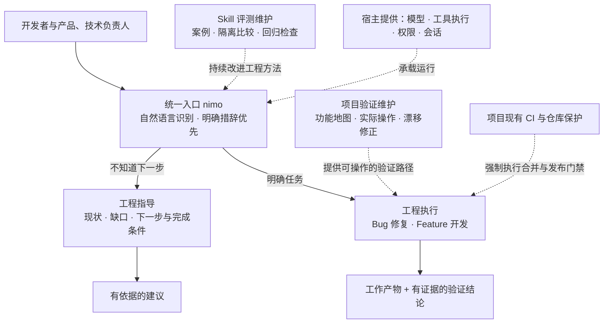

中文 | [English](./README.en.md)

# nimo

**AI 原生工程栈。** 以可安装的 Skill 包进入你已有的 AI 编程工具，一个入口提供两种工作方式：知道要做什么时，让 nimo 执行；不知道下一步时，让它基于项目现状给出有依据的建议。

nimo 不负责替你想模型、跑工具——这些由宿主提供。nimo 提供的是工程纪律：原则、任务做法、可替换的研发能力、真实验证和持续改进，并依据产物和证据判断完成情况。

## 快速开始

前置条件：Codex CLI 0.144 及以上。

```powershell
# Windows（PowerShell）
git clone https://github.com/ttttstc/nimo.git
cd nimo
.\integrations\codex\install.ps1
```

```bash
# macOS / Linux
git clone https://github.com/ttttstc/nimo.git
cd nimo
./integrations/codex/install.sh
```

安装脚本只写入 `CODEX_HOME/skills` 下的 nimo 自有文件并以清单记录所有权，不触碰你的其他配置；支持隔离目录测试安装与干净卸载（`uninstall.ps1` / `uninstall.sh`）。

Claude Code 接入方式相同，见 [integrations/claude-code/README.md](integrations/claude-code/README.md)（写入 `CLAUDE_CONFIG_DIR/skills`，默认 `~/.claude/skills`）。

安装后在任意项目目录发起第一次调用：

```text
codex exec "使用 nimo skill：看看这个项目接下来应该怎么推进，先讨论，不要修改任何文件。"
```

预期得到：当前状态、主要缺口、优先动作和完成条件——且「先讨论」阶段不修改任何文件（可用 `git status` 核对）。更多选项见 [integrations/codex/README.md](integrations/codex/README.md)。

## 业务大图



日常调用就是自然语言：

```text
$nimo 这个需求接下来应该怎么推进？
$nimo 看看登录方案还缺什么，先不要实现。
$nimo 修复登录后一直加载的问题，复现并验证。
$nimo 实现项目列表筛选，保持现有接口兼容。
```

nimo 优先遵守「先讨论」「不要修改」「开始实现」等明确措辞；「继续」只承接最近一条具体行动提议，不会自动扩大范围。

## 能力边界

**第一版做什么：** 工程指导、Bug 修复、Feature 开发，以及支撑它们的项目验证维护和 Skill 评测维护。

**不做什么（边界）：**

- 不自建 Agent Runtime、Workflow Engine、独立任务平台、长期记忆系统或通用插件 SDK——模型调用、工具执行、权限和会话由宿主提供。

- 不替代你项目现有的强制门禁——合并与发布由项目 CI 和仓库保护执行，nimo 的完成检查不绕过它们，提示词也不是安全沙箱。

- 不做长期多项目编排、自动合并发布队列——性能优化、专门重构等可扩展为后续 Playbook，不并入第一版。

- 不自动安装陌生 Skill、不动态拉取未审查脚本——只使用当前环境可见或项目已登记的能力。

- 宿主能力不足时（无并行、无独立上下文、无产品操作工具），如实降级或报告受阻，不把期望当作执行结果。

## 能力状态

第一版规划的能力均已具备：

| 能力         | 覆盖内容                             | 详见                                                                                                                        |
| ---------- | -------------------------------- | ------------------------------------------------------------------------------------------------------------------------- |
| 统一入口       | 指导／执行意图识别、明确措辞优先、授权承接规则          | [skills/nimo-mode](skills/nimo-mode/SKILL.md)                                                                             |
| 工程方法       | 工程原则索引、Bug／Feature Playbook      | [skills/nimo-mode](skills/nimo-mode/SKILL.md)                                                                             |
| 子 Agent 协作 | 六项任务合同、启动规格、验收与停止、检查点与恢复         | [issue-3 执行记录](docs/evidence/issue-3/README.md)                                                                           |
| 宿主接入       | Codex 与 Claude Code 的安装、更新与卸载    | [integrations](integrations/codex/README.md)、[Claude Code](integrations/claude-code/README.md)                            |
| 项目验证       | 功能地图初始化、巡检维护、文档漂移／工具缺口／产品缺陷三分类处置 | [verification-create](skills/nimo-verification-create/SKILL.md)、[verification-maintain](skills/nimo-verification-maintain/SKILL.md) |
| Skill 评测   | 评测案例、评分依据、基线／候选隔离比较、确定性断言与独立评价   | [skill-evaluate](skills/nimo-skill-evaluate/SKILL.md)、[evals](evals/README.md)                                           |

各项能力的实际执行记录与验证证据按 issue 归档于 [docs/evidence/](docs/evidence/)，未验证的范围与已知限制以各期执行记录为准。

## 目录导览

```text
skills/          nimo 入口、安装检测、项目验证与评测 Skill
integrations/    各宿主的薄接入（Codex、Claude Code）
evals/           评测案例、评分依据与运行记录
docs/            总体设计文档与验证证据
```

## 深入了解

- [nimo 总体设计](docs/nimo-overall-design.md)：系统结构、用户路径、功能地图、评测维护与验收要求

- [Codex 接入说明](integrations/codex/README.md) / [Claude Code 接入说明](integrations/claude-code/README.md)：安装、隔离测试、更新与卸载

- [评测运行方法](evals/README.md)：案例组织、隔离执行与评分流程

<br />
