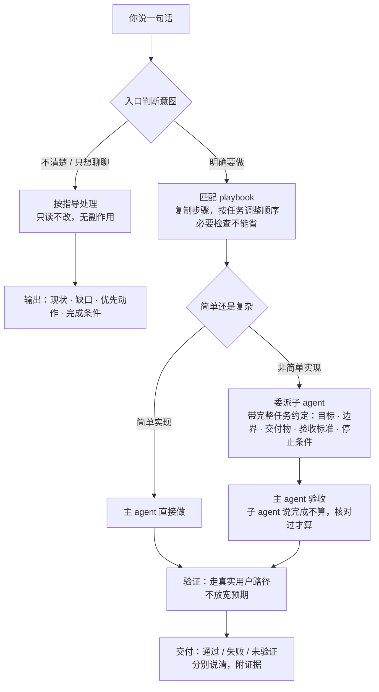

中文 | [English](./README.en.md)

# nimo

我维护 nimo。这一年我看着大家把越来越多的活交给 agent：写得越来越快，验证得越来越少，交付越来越像抽奖。我不接受用吞吐换质量。想走得快，先挖得深。

**nimo 是我的回答。** 它不运行模型、不执行工具——那是宿主（Codex、Claude Code、OpenCode、Cursor、dsh）的事。nimo 做的是工程纪律本身：原则、任务做法、可替换的研发能力、真实验证、持续改进。目标不是最大化代码行数，恰恰相反：**nimo 帮你写得更少，但每一行都有证据。**

**nimo 给你可审计的交付。** 每个结论都挂在产物和证据上：没验证就标未验证，缺条件就报告受阻，跳过的检查如实标注。子 agent 说「已完成」不算数，主 agent 核对过才算数。

**换什么都不换标准。** 换模型、换宿主、换研发 skill，任务目标、工程要求和交付标准不变。换 skill 只换能力层，换宿主只换运行时。

fork 它，改它，把它变成你自己的。欢迎 PR。

## 安装

前置：Codex CLI 0.144+ 或 Claude Code 2.0.20+。

```powershell
# Windows（PowerShell）
git clone https://github.com/ttttstc/nimo.git
cd nimo
.\integrations\codex\install.ps1          # Codex
.\integrations\claude-code\install.ps1    # Claude Code
```

```bash
# macOS / Linux
git clone https://github.com/ttttstc/nimo.git
cd nimo
./integrations/codex/install.sh           # Codex
./integrations/claude-code/install.sh     # Claude Code
```

安装脚本只写 nimo 自己的文件，清单记录所有权，不碰你任何其他配置。卸载干净，隔离目录测试安装随时可复跑。

## 上手

两步：

1. 安装（上面已完成）。
2. 在任意项目目录里说一句：

```text
codex exec "使用 nimo skill：看看这个项目接下来应该怎么推进，先讨论，不要修改任何文件。"
```

就这些。预期得到当前状态、主要缺口、优先动作和完成条件——「先讨论」阶段不修改任何文件，`git status` 可以核对。其余 skill 都是按需的，入口会在需要时调用它们。

## 怎么用

在任务开头用统一入口。它读你的请求，从 playbook 里选，按步骤调用其他 skill。

### 就用 `nimo`

```text
$nimo 这个需求接下来应该怎么推进？

$nimo 修复登录后一直加载的问题，复现并验证。

$nimo 实现项目列表筛选，保持现有接口兼容。
```

被调用后它：

1. 判断意图：指导还是执行。判断不了就按指导处理，没有副作用。
2. 匹配 playbook，拷贝步骤；推荐步骤可按任务重排，必要检查不能静默省略。
3. 按步骤调用 skill；非简单实现默认委派子 agent，带完整任务合同，主 agent 验收。
4. 交付带证据的结论：通过、失败、未验证，分别说清。

明确措辞永远优先于推断：「先讨论」「不要修改」只读不改；「继续」只承接最近一条具体提议，不扩大范围；「停下」就停下并保存现场。完整约定见 [skills/nimo-mode/SKILL.md](skills/nimo-mode/SKILL.md)。

### 主要流程

一个任务从进入到交付的过程：



要点：

1. 意图判断不了就按指导处理，没有副作用。
2. 非简单实现默认委派子 agent，主 agent 验收。
3. 结论只有三种：通过、失败、未验证——没验证就标未验证，缺条件就报告受阻。

### playbooks

| playbook                                                             | 用于                                        |
| -------------------------------------------------------------------- | ----------------------------------------- |
| [feature](skills/nimo-mode/playbooks/feature.md)                     | 新行为或改行为，从明确验收开始，行为验证后交付。                  |
| [bug-fix](skills/nimo-mode/playbooks/bug-fix.md)                     | 复现缺陷，保留失败证据，定位根因，最小修复，区分修复前／后结果。          |
| [investigation](skills/nimo-mode/playbooks/investigation.md)         | 只读理解与判断：X 如何工作、Y 为什么这样建、确信与否。             |
| [refactoring](skills/nimo-mode/playbooks/refactoring.md)             | 保持行为的结构调整或改形。                             |
| [prototype](skills/nimo-mode/playbooks/prototype.md)                 | 廉价试验回答设计问题，或并行比较后选择。                      |
| [perf-issue](skills/nimo-mode/playbooks/perf-issue.md)               | 一次性能问题：定位、测量、改善，对比基线。                     |
| [hillclimb](skills/nimo-mode/playbooks/hillclimb.md)                 | 持续科学改善一个指标：假设循环，前后测量，每次接受一个赢的提交。          |
| [runtime-forensics](skills/nimo-mode/playbooks/runtime-forensics.md) | 运行时取证：诊断活体症状（泄漏、空转、闪烁）。                   |
| [trace-forensics](skills/nimo-mode/playbooks/trace-forensics.md)     | 分析已有取证产物（cpuprofile、trace、heap snapshot）。 |
| [visual-parity](skills/nimo-mode/playbooks/visual-parity.md)         | 像素级 UI 一致性验证。                             |
| [authoring-a-skill](skills/nimo-mode/playbooks/authoring-a-skill.md) | 编写或修改 SKILL.md。                           |
| [eval](skills/nimo-mode/playbooks/eval.md)                           | Skill 行为评测：盲跑候选，隔离比较，回归检查。                |
| [babysit](skills/nimo-mode/playbooks/babysit.md)                     | 检查或跟进 PR：冲突、评审线程、CI。                      |
| [shipping](skills/nimo-mode/playbooks/shipping.md)                   | 独立验证后合入：全栈绿、连续验证、自底向上交付。                  |
| [autonomous-run](skills/nimo-mode/playbooks/autonomous-run.md)       | 持续完成一个目标不停。                               |
| [orchestrate](skills/nimo-mode/playbooks/orchestrate.md)             | 跨会话项目协调：多天、多 PR 链、子 agent 集群。             |
| [autopilot-full](skills/nimo-mode/playbooks/autopilot-full.md)       | 独立事项并行实现并合入，每个 PR 独立负责人，根验证。              |
| [autopilot-stack](skills/nimo-mode/playbooks/autopilot-stack.md)     | 实现并交付一条 PR 链，线性 base-branch stack。        |
| [session-pickup](skills/nimo-mode/playbooks/session-pickup.md)       | 接续或接管先前 agent 的进行中工作。                     |
| [pause-safely](skills/nimo-mode/playbooks/pause-safely.md)           | 安全暂停进行中工作以便稍后恢复。                          |
| [multi-phase-plan](skills/nimo-mode/playbooks/multi-phase-plan.md)   | 跨阶段或堆叠 PR 的工作。                            |
| [worktree-cleanup](skills/nimo-mode/playbooks/worktree-cleanup.md)   | 清理已合入或废弃的 worktree 和临时目录，安全门控。            |
| [opening-a-pr](skills/nimo-mode/playbooks/opening-a-pr.md)           | 从有序提交整理并创建 PR。其他 playbook 末尾自动调用。         |

### 例子

```
bug fix:           $nimo 这个 PR 有个微妙 bug，滚动在空闲时每 750ms 漂移。
                   先复现，再修复并验证。

perf:              $nimo 大列表即使虚拟化了也要一两秒才加载。
                   跑一次 CPU trace，告诉我原因。

feature:           $nimo 在 feature flag 后面建一个小功能，验证它真的能用。

prototype:         $nimo 建两个 markdown 渲染器的原型来比较。
                   每个 spawn 一个 agent。

overnight run:     $nimo 我要睡了。让 stack 合入，CI 偶尔 flake 也没关系。
                   明早我想要全部已合入。

babysit:           $nimo 查看 PR 123，还有什么是突出的？

visual parity:     $nimo 这个 flag 打开时行间距太高，第二张图是对的。
                   复现并修到匹配。

figure it out:     $nimo 我要离开了。把每个调用方从同步 store 迁移到新异步
                   store，保持行为一致。我回来时要能信任它做对了。

how:               $how 我们怎么取消 run？逐个 run 查找取消时有没有 N+1？

why:               $why 这个 feature flag 还没打开？

architect:         先 /architect，把插桩设计成高信号无假阳性。

arena:             $arena 把我的 prompt 原样送去竞技场，我想比较它们和你
                   的提案。

swarm:             $swarm 对 packages/ 下每个包跑 check.sh，一个包一个
                   worker，一份汇总报告。

interrogate:       $interrogate 评审这个 PR。

tdd:               $tdd 实现

unslop:            能不能 unslop 并收紧新改动？

reflect:           $reflect 那次跑太久了。把学到的记下来，下次不重复。

show-me-your-work: $show-me-your-work 保留一条决策轨迹，我回来能审查。

```

## skills

`nimo-mode` 在步骤需要时自动调用大部分 skill（`how`、`why`、`architect`、`arena`、`swarm`、`interrogate`、`unslop`、`no-comments`、`technical-writing`、`tdd` 及各原则）。下表是你要直接用的时候：

| skill                                                                    | 什么时候用                                                 |
| ------------------------------------------------------------------------ | ----------------------------------------------------- |
| [nimo-mode](skills/nimo-mode/SKILL.md)                                   | 任何正经任务的默认入口。                                          |
| [nimo-how](skills/nimo-how/SKILL.md)                                     | 想走读一个子系统如何工作。                                         |
| [nimo-why](skills/nimo-why/SKILL.md)                                     | 想知道某东西为什么这样建——运行时枚举七类证据并行查。                           |
| [nimo-architect](skills/nimo-architect/SKILL.md)                         | 准备写跨函数边界代码，先定调用方用法、类型与模块形状。                           |
| [nimo-arena](skills/nimo-arena/SKILL.md)                                 | 同一任务并行 N 个候选，逐字读完后嫁接最强部分。                             |
| [nimo-swarm](skills/nimo-swarm/SKILL.md)                                 | N 个并行 worker 各管一个切片或竞速，一份汇总报告。                        |
| [nimo-interrogate](skills/nimo-interrogate/SKILL.md)                     | 有个 diff，想让几个不同模型试着打破它，含严格代码质量视角。                      |
| [nimo-figure-it-out](skills/nimo-figure-it-out/SKILL.md)                 | 没有更窄 playbook 可用——设计可审计执行方案（大型迁移、多部分改动）。              |
| [nimo-tdd](skills/nimo-tdd/SKILL.md)                                     | 修 bug 且有便宜本地测试路径——先写失败测试，再写修复。                        |
| [nimo-verify](skills/nimo-verify/SKILL.md)                               | 实现后 / 回归 / 合入 / 交付前验证——走真实用户路径，不放宽预期。                 |
| [nimo-deslop](skills/nimo-deslop/SKILL.md)                               | 提交前清理本次差异：叙述性注释、死兼容路径、无关改动。                           |
| [nimo-unslop](skills/nimo-unslop/SKILL.md)                               | 删除任何文字中的 AI 腔调，加回人的声音。                                |
| [nimo-no-comments](skills/nimo-no-comments/SKILL.md)                     | 清理 / 评审注释；约束注释优先转成类型 / 运行时 / 测试 / CI 约束。              |
| [nimo-show-me-your-work](skills/nimo-show-me-your-work/SKILL.md)         | 长时 / 无人值守工作，保留可审查决策轨迹（TSV 日志）。                        |
| [nimo-skill-author](skills/nimo-skill-author/SKILL.md)                   | 创建或修改 SKILL.md：编写可运行、可验证的 Skill。                      |
| [nimo-skill-evaluate](skills/nimo-skill-evaluate/SKILL.md)               | Skill 行为评测与版本比较：候选盲跑、隔离运行、评分。                         |
| [nimo-technical-writing](skills/nimo-technical-writing/SKILL.md)         | 四层技术写作标准：Diataxis 结构、Google 风格、STE 规则、Global English。 |
| [nimo-verification-create](skills/nimo-verification-create/SKILL.md)     | 项目还没有可证明行为的验证方式。生成项目本地验证 skill 和功能地图。                 |
| [nimo-verification-maintain](skills/nimo-verification-maintain/SKILL.md) | 功能地图和产品漂移了。源码核对＋实际跑一遍，三分类处置。                          |
| [nimo-setup](skills/nimo-setup/SKILL.md)                                 | 安装检测与配置：安装、更新、卸载、能力检测。                                |
| [configure-nimo](skills/configure-nimo/SKILL.md)                         | 添加 / 删除 / 查看 / 校验团队和个人原则与知识来源。                        |

## 在栈里的位置


nimo 是 AI 研发栈里的「工程方法层」：

| 层          | 谁提供                                           | 管什么                        |
| ---------- | --------------------------------------------- | -------------------------- |
| 模型层        | LLM                                           | 推理                         |
| agent 运行时层 | Codex / Claude Code / OpenCode / Cursor / dsh | 模型调用、工具、权限、会话、子 agent      |
| **工程方法层**  | **nimo**                                      | 原则、playbook、能力合同、质量门禁、评测维护 |
| 项目资产层      | 你的项目 `.nimo/`                                 | 功能地图、验证脚本、检查点              |
| 强制控制层      | 你的 CI 和仓库保护                                   | 合并、发布的强制门禁                 |

nimo 定义「怎样才算做对了、做完了」，宿主执行，你的 CI 兜底。你的 CI 永远是最后一道门，nimo 不替代它。

## 原则

23 条工程原则，一条一个。入口在任务开始时读索引，按需展开，不逐条罗列原则名。

| 原则                                       | 规则                                 |
| ---------------------------------------- | ---------------------------------- |
| attack-the-premise                       | 多个共享同一前提的修复连续在同一验证门槛失败时，先质疑共同前提。       |
| laziness-protocol                        | 偏向删除，以及能解决问题的最小改动。                 |
| foundational-thinking                    | 写逻辑前先把数据结构做对，让下游代码变得显然。            |
| subtract-before-you-add                  | 先删死重／冗余校验器／桩引用，再在更简单基础上构建。         |
| minimize-reader-load                     | 统计问题与答案之间层数，内联单调用者包装，缩小可变作用域。      |
| outcome-oriented-execution               | 收敛到目标架构，不用一次性兼容代码维持平滑中间状态。         |
| experience-first                         | 取舍时选用户愉悦而非实现方便；更少打磨 > 更多粗糙。        |
| exhaust-the-design-space                 | 面对不确定决策时建 2-3 个竞争原型并排比较。           |
| build-the-lever                          | 构建可复跑工具而非手工执行；工具是审阅者可复跑的产物。        |
| redesign-from-first-principles           | 把新需求当作基础假设重新设计，而非外挂补丁。             |
| model-the-domain                         | 把领域编码进结构，而非散落的条件判断。                |
| boundary-discipline                      | 防护集中在系统边界，内部信任类型，业务逻辑保持纯函数。        |
| type-system-discipline                   | 让非法状态不可表示，从权威 schema 派生。           |
| make-operations-idempotent               | 命令在崩溃／重启中收敛到同一正确终态。                |
| prove-it-works                           | 对着真实产物验证，而非代理信号／自报／"能编译"。          |
| fix-root-causes                          | 追到根因修复，先复现，连续追问为什么，抵制压崩溃。          |
| sequence-verifiable-units                | 多步工作拆成每个以可验证状态收尾的小单元，交付顺序自证。       |
| test-behavior-not-implementation         | 按真实调用方式测试可观察行为，不用内部调用关系锁死实现。        |
| guard-the-context-window                 | 上下文接近占满时把大宗路由给子 agent，主上下文保留摘要。    |
| never-block-on-the-human                 | 可逆工作先推进，确认只留给不可逆动作。                |
| encode-lessons-in-structure              | 把反复出现的规则编码为 lint／元数据／运行时检查，而非更多文字。 |
| separate-before-serializing-shared-state | 并发写同一状态时先消除共享，单一写者时才结构化串行。         |
| migrate-callers-then-delete-legacy-apis  | 同一波次里迁移调用方并删除旧 API，不留兼容层。          |

完整规则、适用情境与例外见 [skills/nimo-mode/SKILL.md](skills/nimo-mode/SKILL.md)。

## 不做什么

- 不自建 agent 运行时、workflow engine、任务平台、长期记忆、插件 SDK。宿主有就用宿主的，宿主没有就如实降级。

- 不替代你的 CI 和仓库保护。完成检查是工程要求，不是强制门禁；提示词也不是安全沙箱。

- 不做多项目编排、自动合并发布队列。性能优化、专门重构以后再说，不进第一版。

- 不自动安装陌生 skill，不动态拉取未审查脚本。只用当前环境可见或项目已登记的能力。

- 宿主缺能力（无并行、无独立上下文、无产品操作工具）时，如实报告受阻，不把期望当结果。

## 团队与个人知识

无需配置即可使用默认方法。需要外部资料时，直接说"把 ./docs 加到项目知识"或"把 \~/knowledge 加到我的个人知识"。

项目配置为 .nimo/nimo.yaml，个人配置为 \~/.nimo/nimo.yaml：

```yaml
principles:
  - skill: company-api-first
  - path: ./engineering/principles/reliability.md
knowledge:
  - ./docs
```

团队配置中的相对路径以项目根为准，个人配置以用户主目录为准。对话中相对路径先按当时工作目录定位，再转换保存。配置只保存引用，不复制原资料；知识按任务检索，不整库注入。"这次不用某来源"只影响当前会话。

## 实测状态

部分运行验证证据随仓库归档，其余按任务在本地保留。说几点真的：

- Claude Code 2.1.23 里真实跑通过：会话 attribution 证明 skill 被加载，「先讨论」后 `git status` 干净，指导输出四要素齐全（[issue-8](docs/evidence/issue-8/real-invocation.log)）。

- 功能地图维护巡检在样例项目上真实抓到过文档漂移、工具缺口和一个真产品缺陷——前两者修了并复跑通过，缺陷如实上报，没改预期去迎合它。

- 子 agent 协作纪律 10 项实测通过（[issue-3](docs/evidence/issue-3/README.md)）；安装脚本 12 项行为测试通过（[issue-2](docs/evidence/issue-2/install-scripts-test.log)）。

还没验证的：Codex 内真实调用、官方 Anthropic 端点下的行为、原生 macOS/Linux、bug playbook 端到端、候选比较。没验证就不算能用。

## 更多

- [nimo 总体设计](docs/nimo-overall-design.md)：系统结构、用户路径、功能地图、评测维护与验收要求。

- [Codex 接入](integrations/codex/README.md) / [Claude Code 接入](integrations/claude-code/README.md) / [OpenCode 接入](integrations/opencode/README.md) / [Cursor 接入](integrations/cursor/README.md) / [dsh 接入](integrations/dsh/README.md)：安装、隔离测试、更新与卸载。

- [skill-evaluate](skills/nimo-skill-evaluate/SKILL.md)：评测案例组织、隔离执行与评分流程。
