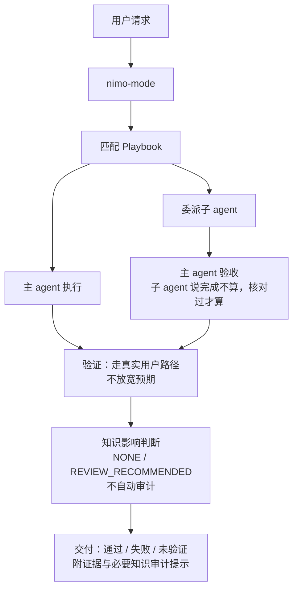
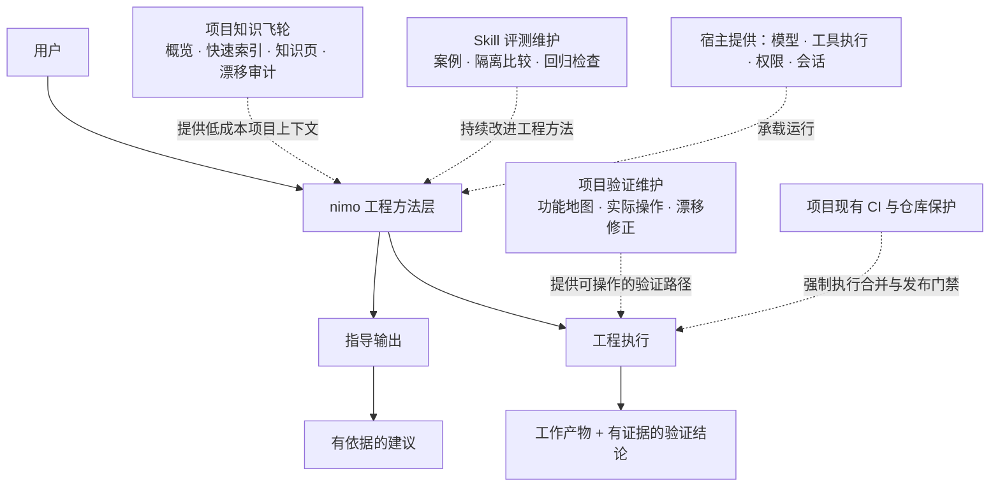

# nimo

AI-Native SDLC 的工程方法运行载体。

> nimo 把成熟的工程原则、playbook、skill、质量门禁、验证维护和项目知识组织成宿主无关的工程工作方式。它不替代 Codex、Claude Code、OpenCode、Cursor、dsh 等 agent runtime，也不替代项目 CI。

## 为什么是 nimo

LLM 能写代码，但团队真正缺的往往不是“再多一个模型”，而是一套稳定的工程行为：什么时候先调查，什么时候必须设计，怎样拆任务，怎样验证，什么时候停，怎样让经验进入下一轮工作。

nimo 把这些规则放进可以执行、组合、检查和持续维护的工程栈中：

- Principles：长期稳定的工程判断原则。
- Playbooks：常见工程任务的步骤骨架。
- Skills：具体能力和方法。
- Gates：需要真实证据的质量边界。
- Verification：项目自己的真实行为地图与验证入口。
- Knowledge：项目事实的低成本上下文与维护闭环。

## 快速开始

安装后，在支持 Skill 的宿主中调用：

```text
$nimo
```

然后直接描述任务，例如：

```text
$nimo 实现项目列表筛选，保持现有接口兼容。
```

nimo 的基本流程：

1. 判断意图：指导还是执行。判断不了就按指导处理，没有副作用。
2. 匹配 playbook，拷贝步骤；推荐步骤可按任务重排，必要检查不能静默省略。
3. 按步骤调用 skill；非简单实现默认委派子 agent，带完整任务合同，主 agent 验收。
4. 对产生项目变更的任务，在交付前做一次轻量知识影响判断；只记录是否建议后续审计，不自动运行知识审计。
5. 交付带证据的结论：通过、失败、未验证，分别说清。

明确措辞永远优先于推断：「先讨论」「不要修改」只读不改；「继续」只承接最近一条具体提议，不扩大范围；「停下」就停下并保存现场。完整约定见 [skills/nimo-mode/SKILL.md](skills/nimo-mode/SKILL.md)。



要点：

1. 意图判断不了就按指导处理，没有副作用。
2. 非简单实现默认委派子 agent，主 agent 验收。
3. 结论只有三种：通过、失败、未验证——没验证就标未验证，缺条件就报告受阻。
4. 普通工程任务不会自动运行知识审计；重大事实变化只产生后续审计信号。

### playbooks

nimo 内置 23 个 Playbook：

| Playbook | 用途 |
| --- | --- |
| feature | 新增或改变行为 |
| bug-fix | 缺陷修复 |
| investigation | 只读理解与判断 |
| refactoring | 保持行为的结构调整 |
| prototype | 用廉价试验回答设计问题 |
| perf-issue | 一次性能问题修复 |
| hillclimb | 持续改善一个指标 |
| runtime-forensics | 运行时取证 |
| trace-forensics | 分析已有取证产物 |
| visual-parity | 保持视觉一致 |
| authoring-a-skill | 创建或修改 Skill |
| eval | Skill 行为评测 |
| opening-a-pr | 整理并创建 PR |
| babysit | 检查或跟进 PR |
| shipping | 验证后合入 |
| multi-phase-plan | 多阶段实施计划 |
| autonomous-run | 持续完成一个目标 |
| orchestrate | 跨会话项目协调 |
| autopilot-full | 独立事项实现并合入 |
| autopilot-stack | 实现并交付 PR 链 |
| session-pickup | 接续已有工作 |
| pause-safely | 安全暂停 |
| worktree-cleanup | 核实后清理工作目录 |

一次大型任务没有固定流程时由 `nimo-figure-it-out` 组合，不再额外增加固定 Playbook。

### 常用入口

```text
how:               $nimo-how 先分析怎么做，不要实现。

architect:         $nimo-architect 比较几个设计方案，给出取舍。

verify:            $nimo-verify 按真实用户路径验证这个改动。

configure:         $configure-nimo 把 ./docs 加到项目知识。

reflect:           $reflect 那次跑太久了。把学到的记下来，下次避免。

show-me-your-work: $show-me-your-work 保留一条决策轨迹，我回来能审查。

knowledge audit:   $nimo 审计项目知识是否过时，检查索引和项目事实有没有漂移。

knowledge refresh: $nimo 刷新项目知识；如果还没有项目事实就建立一份全仓知识基线。
```

## skills

`nimo-mode` 在步骤需要时自动调用大部分 skill（`how`、`why`、`architect`、`arena`、`swarm`、`interrogate`、`unslop`、`no-comments`、`technical-writing`、`tdd` 及各原则）。知识审计第一版只接受用户显式调用或定时/外部例程调用，不由普通工程任务主动触发。下表是你要直接用的时候：

| skill | 什么时候用 |
| --- | --- |
| [nimo-how](skills/nimo-how/SKILL.md) | 先调查现状和约束，给出最小可行方案。 |
| [nimo-why](skills/nimo-why/SKILL.md) | 解释现有设计为什么这样做。 |
| [nimo-architect](skills/nimo-architect/SKILL.md) | 跨边界、长期影响或多个可行结构之间做架构取舍。 |
| [nimo-arena](skills/nimo-arena/SKILL.md) | 多个候选方案需要独立比较。 |
| [nimo-swarm](skills/nimo-swarm/SKILL.md) | 适合并行调查或相互独立的工作单元。 |
| [nimo-interrogate](skills/nimo-interrogate/SKILL.md) | 需求含糊、目标或约束不清时系统澄清。 |
| [nimo-deslop](skills/nimo-deslop/SKILL.md) | 提交前清理本任务引入的低质量残留。 |
| [nimo-no-comments](skills/nimo-no-comments/SKILL.md) | 审查前删除无价值解释性注释，保留真正必要说明。 |
| [nimo-unslop](skills/nimo-unslop/SKILL.md) | 清理模板腔、重复和空洞表达。 |
| [nimo-technical-writing](skills/nimo-technical-writing/SKILL.md) | 四层技术写作标准：Diataxis 结构、Google 风格、STE 规则、Global English。 |
| [nimo-verification-create](skills/nimo-verification-create/SKILL.md) | 项目还没有可证明行为的验证方式。生成项目本地验证 skill 和功能地图。 |
| [nimo-verification-maintain](skills/nimo-verification-maintain/SKILL.md) | 功能地图和产品漂移了。源码核对＋实际跑一遍，三分类处置。 |
| [nimo-knowledge-audit](skills/nimo-knowledge-audit/SKILL.md) | 用户或定时任务要检查项目知识：只读识别事实、概览、索引和关系漂移。 |
| [nimo-knowledge-maintain](skills/nimo-knowledge-maintain/SKILL.md) | 建立或刷新项目知识：支持基线、增量和全量，把全仓事实编译成概览→索引→知识页。 |
| [nimo-setup](skills/nimo-setup/SKILL.md) | 安装检测与配置：安装、更新、卸载、能力检测。 |
| [configure-nimo](skills/configure-nimo/SKILL.md) | 添加 / 删除 / 查看 / 校验团队和个人原则与知识来源。 |

## 架构边界



nimo 是 AI 研发栈里的「工程方法层」：

| 层 | 谁提供 | 管什么 |
| --- | --- | --- |
| 模型层 | LLM | 推理 |
| agent 运行时层 | Codex / Claude Code / OpenCode / Cursor / dsh | 模型调用、工具、权限、会话、子 agent |
| **工程方法层** | **nimo** | 原则、playbook、能力合同、质量门禁、知识/验证维护、评测维护 |
| 项目资产层 | 你的项目与已登记知识路径 | 代码、原位知识、功能地图、验证脚本、检查点 |
| 强制控制层 | 你的 CI 和仓库保护 | 合并、发布的强制门禁 |

nimo 定义「怎样才算做对了、做完了」，宿主执行，你的 CI 兜底。你的 CI 永远是最后一道门，nimo 不替代它。

## 配置

无需配置即可使用默认方法。需要外部资料时，直接说"把 ./docs 加到项目知识"或"把 \~/knowledge 加到我的个人知识"。

项目配置为 .nimo/nimo.yaml，个人配置为 \~/.nimo/nimo.yaml：

```yaml
principles:
  - skill: company-api-first
  - path: ./engineering/principles/reliability.md
knowledge:
  - ./docs
```

团队配置中的相对路径以项目根为准，个人配置以用户主目录为准。对话中相对路径先按当时工作目录定位，再转换保存。配置只保存引用，不复制原资料；知识正文始终保留在用户自己的文件或目录中，不要求搬到 `.nimo`。"这次不用某来源"只影响当前会话。

### 项目知识飞轮

`nimo-knowledge-maintain` 把代码、配置、接口、测试和运行方式中的稳定项目事实编译成适合 Agent 渐进读取的知识：

```text
Overview（高压缩项目概览）
    ↓
Index（全仓快速知识索引）
    ↓
Knowledge Pages（具体事实与证据）
    ↓
代码 / 配置 / 测试 / 接口
```

没有项目事实时支持建立基线；已有可信维护基线时默认做增量刷新；用户明确要求或基线不可用时做全量核对。目录、文件位置都由 `knowledge` 配置决定，nimo 只维护明确登记的目标。

`nimo-knowledge-audit` 严格只读，检查事实、覆盖、Overview、Index 和页面关系是否漂移。第一版不会在普通开发任务中自动运行，只由用户显式调用或定时/外部例程触发。人工直接修改 Knowledge 后不需要同步修改 state：Audit 会通过当前文件指纹识别变化并重新核对事实；如果内容已经正确仍可判 CLEAN，后续由 `nimo-knowledge-maintain` 在普通增量刷新中保持正文不动、只把维护 state 更新到当前内容。发现真实漂移时同样由 Maintain 做最小修复并刷新 state。

普通工程任务只在交付前判断一次 `Knowledge Impact`。重大模块、接口、Schema、配置契约、运行链路等变化会标记 `REVIEW_RECOMMENDED`，供后续人工或定时审计优先消费；这个判断不扫描知识库，也不自动触发审计。`NONE` / `REVIEW_RECOMMENDED` 结论本身不阻断交付；长期 program 已有确认变更时，进入 `delivered` 必须同步记录一个新的合法影响结论，不能以缺失或旧结论结束。

这个闭环把工程变化持续沉淀为下一次 Agent 可复用的上下文：**工程事实 → 变化信号 → 知识审计 → 知识编译 → 低成本查询 → 下一轮工程活动。**

## 实测状态

部分运行验证证据随仓库归档，其余按任务在本地保留。说几点真的：

- Claude Code 2.1.23 里真实跑通过：会话 attribution 证明 skill 被加载，「先讨论」后 `git status` 干净，指导输出四要素齐全（[issue-8](docs/evidence/issue-8/real-invocation.log)）。

- 功能地图维护巡检在样例项目上真实抓到过文档漂移、工具缺口和一个真产品缺陷——前两者修了并复跑通过，缺陷如实上报，没改预期去迎合它。

- 子 agent 协作纪律 10 项实测通过（[issue-3](docs/evidence/issue-3/README.md)）；安装脚本 12 项行为测试通过（[issue-2](docs/evidence/issue-2/install-scripts-test.log)）。

还没验证的：Codex 内真实调用、官方 Anthropic 端点下的行为、原生 macOS/Linux、bug playbook 端到端、候选比较。没验证就不算能用。

## 更多

- [nimo 总体设计](docs/nimo-overall-design.md)：系统结构、用户路径、功能地图、评测维护与验收要求。

- [Codex 接入](integrations/codex/README.md) / [Claude Code 接入](integrations/claude-code/README.md) / [OpenCode 接入](integrations/opencode/README.md) / [Cursor 接入](integrations/cursor/README.md) / [dsh 接入](integrations/dsh/README.md)：安装、隔离测试、更新与卸载。

- [skill-evaluate](skills/nimo-skill-evaluate/SKILL.md)：评测案例组织、隔离执行与评分流程。
