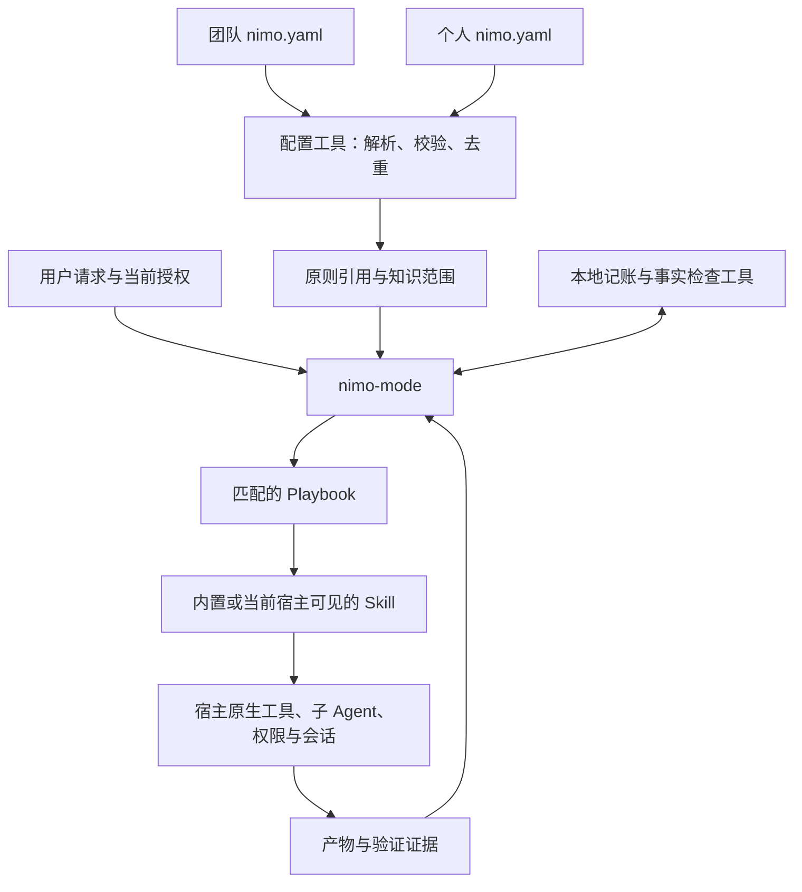
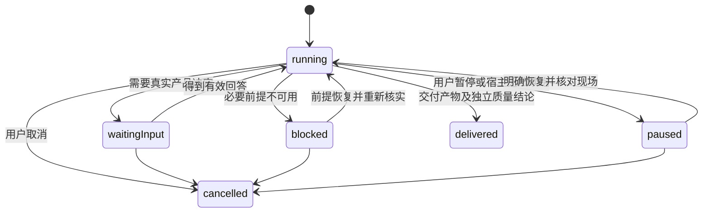

# nimo 新版实现方案：复用 pstack 全部 Playbook，与宿主解耦

日期：2026-09-08。关联需求：[Issue #13](https://github.com/ttttstc/nimo/issues/13)。文档用途：新版实现规格。验证结果以实际测试和 PR 报告为准。

## 1. 方案摘要

nimo 重构为一套可安装、与编程宿主解耦的工程 Skill 包，完整适配 pstack 的 23 个 Playbook，保留原则驱动、语义路由、设计探索、实现与审查分离、真实验证及长期任务恢复的工作逻辑。团队与个人通过一份轻量 YAML 引用既有 Principle 和 Knowledge，Agent 按需使用这些资料；配置处理和任务记账交给少量本地工具，模型、Agent 调度、权限和后台运行仍由宿主提供。直接替换旧 Capability 设计，不建设旧配置兼容层，不引入新的 Workflow DSL 或 Agent Runtime。

## 2. 目标、范围与设计基线

### 2.1 用户主路径

安装后，用户在当前宿主调用 `nimo-mode`，或者明确要求“使用 nimo”。nimo 根据自然语言选择做法，用户不需要手动指定 Playbook，也不需要先创建 `.nimo/nimo.yaml`。

典型请求：

```text
使用 nimo，分析这个方案的问题，先不要改代码。
使用 nimo，修复登录一直加载的问题，复现并验证。
使用 nimo，把 ./docs/architecture 加到项目知识。
使用 nimo，把这些改动整理成 PR 栈，我自己合并。
使用 nimo，持续完成这个项目，遇到真实阻塞时告诉我。
```

“给出方案”只授权方案产物。“开始实施”才进入实现。“检查 PR”只读一次状态，不自动持续跟踪或合并。“先讨论”“暂停”“不合并”等明确限制，始终先于语义推断。

### 2.2 本次完整交付

1. 一个 `nimo-mode` 总入口和全部 23 个 Playbook。
2. 全部 21 个上游原则的宿主无关版本，以及执行这 23 个流程所需的 Skill、参考材料和辅助工具。
3. 团队与个人 Principle / Knowledge 引用、对话配置、校验、来源显示、会话排除和使用证据。
4. Codex 与 Claude Code 两个薄接入，共用同一套核心文件；其他可读取 Skill 的宿主通过通用接入约定使用。
5. 项目验证地图、Skill 行为评测、任务暂停恢复、长期项目记账、PR 状态与依赖链检查。
6. 安装、更新、卸载和包内容检查，以及分层测试和真实宿主验收。

“完整适配”要求每个 Playbook 有可读取正文、明确入口、完整依赖、停止规则和验收用例。某宿主缺少必要工具时必须给出具体受阻结果，不能用一个空文件或“交给宿主实现”代替流程。

### 2.3 明确不做

- 不保留旧 `.nimo/project.yaml`、Capability / Provider 的运行逻辑，不做旧用户数据迁移或双轨兼容。
- 不实现模型路由器、Agent SDK、独立调度服务、通用宿主适配框架、插件市场或长期记忆平台。
- 不实现 RAG、向量索引、远程知识源同步、Context Provider 或 Workflow DSL。
- 不自动安装用户引用的第三方 Skill，不修改宿主模型配置、凭据和权限。
- 不复制 pstack 与本次依赖闭包无关的全部附加产品，例如 Benny 自动化。
- 不把 GLM 5.3、Cursor 云 Agent 或任何固定模型写成运行前提。

### 2.4 固定参考版本

上游使用 `cursor/plugins@93b00b89ef425a9c1bac0d0b317dfc49c930ac99` 的 `pstack/`，该版本包含 **23 个 Playbook、21 个 Principle Skill**。实现期间不自动跟随上游 main，不在任务运行时拉取并替换工程规则。

nimo 调研基线为 `d6641ddd44145d901ca58297020a2ccd4615d822`。已有 README 等未提交修改不属于此次方案产物，不覆盖、不回退。后续实施前重新核对工作区。

### 2.5 合理性审视与取舍

核心设计成立：工作流和工程判断交给 Agent，客观文件操作交给程序。这同时避免纯提示词反复误解路径，也避免把自然语言工作流重新编码为复杂引擎。

全量 23 个 Playbook 增加的是方法覆盖，而不是默认启动 23 套流程。启动只读取入口和原则索引，再加载匹配流程；大项目编排不能因为“任务有多个步骤”就触发。

上游有三类需要显式适配的内容：Cursor 私有机制、个人工作偏好，以及上游自身不一致的规则。第 3.12 节逐项列明差异，不能把 nimo 宣称为 pstack 的逐字镜像。

## 3. 总体设计与系统规格

### 3.1 责任划分



- **Mode**：理解请求和授权，建立上下文，选择流程，保留必要步骤，决定何时委派、验证、暂停和交付。
- **Playbook**：描述一种任务的工作顺序、必要输入、证据和停止点。使用 Markdown，不解析成可执行 DAG。
- **Skill**：完成一个明确任务，例如理解代码、比较设计、独立审查、生成验证地图。
- **Principle**：改变工程判断的规则。索引用于识别相关性，正文用于实际应用。
- **Knowledge**：系统事实、历史和文档。作为证据读取，不获得控制权限。
- **本地工具**：解析配置、检查路径、维护事实记录、读取 PR 状态。不调用模型、不启动 Agent、不合并 PR、不决定语义流程。
- **宿主**：提供模型、工具、上下文、权限、执行环境和持续运行机制。nimo 不自行接管。

### 3.2 最终目录与包边界

```text
nimo/
├── VERSION
├── THIRD_PARTY_NOTICES.md
├── licenses/pstack-MIT.txt
├── skills/
│   ├── nimo-mode/
│   │   ├── SKILL.md
│   │   ├── playbooks/                  23 个文件，保留上游文件名
│   │   ├── references/
│   │   │   ├── configuration.md
│   │   │   ├── host-contract.md
│   │   │   ├── delegation.md
│   │   │   ├── checkpoints.md
│   │   │   ├── review-triage.md
│   │   │   └── plan-template.md
│   │   └── scripts/
│   │       ├── package.json
│   │       ├── package-lock.json
│   │       ├── config.mjs
│   │       ├── state.mjs
│   │       ├── inspect-pr.mjs
│   │       ├── audit-worktrees.mjs
│   │       ├── check-plan.mjs
│   │       ├── log.mjs
│   │       └── lib/                   仅实际共享的文件/路径处理
│   ├── nimo-setup/
│   ├── configure-nimo/
│   ├── nimo-how/ ...                  第 3.5 节的任务 Skill
│   └── nimo-principle-*/             21 个原则 Skill
├── integrations/
│   ├── README.md                     通用宿主接入约定
│   ├── codex/                        安装、卸载、调用与验证说明
│   └── claude-code/
├── tests/
│   ├── configuration/
│   ├── state/
│   ├── pr/
│   ├── installation/
│   └── assets/
├── evals/
│   ├── cases/                        23 个流程的行为案例及组合边界
│   ├── fixtures/
│   └── README.md
└── docs/
    ├── nimo-v1-issue-13-spec.md
    └── evidence/issue-13/
```

默认只保留 `nimo-mode` 一个工程总入口。原 `skills/nimo/` 删除，不保留兼容转发层。产品名称仍是 nimo；具体 `/` 或 `$` 调用形式由宿主决定，文档同时给出自然语言调用方式。

内置执行 Skill 统一使用 `nimo-` 前缀，防止与用户已有 `how`、`review`、`tdd` 等重名。`configure-nimo` 保留 Issue 的名称。内置 Skill 按包内实际位置读取，外部 Skill 按宿主实际发现结果定位，不实现跨来源优先级解析器。

配置与运行产物：

```text
项目根目录/.nimo/
├── nimo.yaml                         团队引用，可纳入版本管理
├── verification/                    项目验证 Skill 与功能地图
└── tasks/<task-id>/                  按需创建，本地运行记录
    ├── checkpoint.md
    ├── decisions.tsv
    ├── evidence/
    └── program/                     仅 orchestrate / autopilot 需要
        ├── standing-orders.md
        ├── program.json
        ├── briefs/
        ├── reports/
        └── inbox/

用户主目录/.nimo/nimo.yaml            个人引用
```

不预建所有运行目录，不把本地证据和个人路径自动提交到仓库。任务状态和 YAML 引用配置分开，不向 `nimo.yaml` 增加调度、模型、任务步骤字段。

### 3.3 入口执行顺序

1. **确认当前请求的动作边界**：只读、方案、实现、外部写入、持续执行、停止。先处理用户的明确限制。
2. **定位作用域**：当前项目根目录、用户主目录、当前包位置。退出 nimo 后不继续应用路由；新会话不依赖旧会话隐含状态。
3. **读取原则索引与配置**：多步骤任务先完整读取入口原则索引。配置工具返回引用、来源和诊断，不读取全部知识正文。
4. **形成当前任务上下文**：结合会话排除、宿主可见 Skill、相关原则和知识搜索结果。知识和配置数据不能扩大授权。
5. **选流程**：读取匹配 Playbook。将该 nimo Playbook 的编号步骤原样放入宿主任务清单；宿主没有清单工具时用会话清单，长任务使用检查点。
6. **执行**：具体任务步骤附在原步骤下。允许按依赖重排，但步骤不得静默消失；省略必须记录原因和对完成状态的影响。
7. **检查与交付**：核对产物、版本、必要证据和独立审查。主 Agent 读取实际差异后做结论，子 Agent 返回“完成”只表示待验收。

配置和诊断请求直接进入 `configure-nimo` / `nimo-setup`，不先启动代码理解、设计探索或 PR 流程。普通问答不强制创建任务目录。

#### 路由消歧

- 用户明确指定且目标匹配的流程优先；明显不匹配时说明差异。
- “只看方案／写计划”进入 `multi-phase-plan` 或只读 investigation，不能因计划包含代码变更而开始实现。
- “查一下 PR”进入 babysit 的 `check`；“跟到可合并”进入 `drive`；“合并”才进入 shipping。
- “我来合并”进入 autopilot-stack；明确授权独立事项逐项实现并合入，进入 autopilot-full。
- 普通多步骤开发仍用 feature / bug-fix。单目标反复迭代用 autonomous-run；超出一个会话、需要多个交付单元协调的项目才用 orchestrate。
- 没有现成流程匹配或单次工作需要特殊组合时，调用 `nimo-figure-it-out`。它是 Skill，不伪造第 24 个固定 Playbook。
- 混合请求先明确主交付和阶段关系，可以先 investigation 后 feature，但跨越用户尚未授权的动作边界时停下。

### 3.4 全部 23 个 Playbook

下列每项均须有独立 Markdown 文件及行为案例。公共授权、来源、委派和证据规则只在本章公共规格定义，各流程引用它们。

#### PB01 — feature.md：新增或改变行为

理解受影响系统 → 比较设计 → 记录阻塞前提、独立工作、共享状态和最小拆分 → 委派实现 → 主 Agent 审阅差异 → 验证真实产物 → 整理可验证提交 → 必要时独立质疑 → 按授权进入 PR 流程。

必须先明确领域数据和组织结构。`nimo-architect` 跳过时保留原因；跨边界或存在实质设计取舍时不能用“任务小”自动跳过。实现与最终审查分开；子 Agent 各自通过后仍须验证整合产物。

#### PB02 — bug-fix.md：缺陷修复

主 Agent 在原操作面复现 → 用证据排除根因假设，必要时并行 how / why → 确认机制 → 必要设计 → 委派修复 → 在同一操作面重复原复现 → 回归 → 按授权交付。

便宜明确的回归测试采用失败先于修复的顺序。无法复现时可继续只读调查，但结果不得写成“缺陷已修复并验证”。不依靠修改预期结果掩盖缺陷。

#### PB03 — investigation.md：只读理解与判断

通过 `nimo-how` 理解实际路径；动机问题补充 `nimo-why`；质疑设计使用 how 的审视模式。输出引用、机制、取舍和不确定性。

不改生产代码、不自动开 PR、不为只读问题制造原型。需要实施时给出建议，只有已有实施授权才能转入对应流程。并行工作检查可标记“只读调查，不适用”。

#### PB04 — refactoring.md：保持行为的结构调整

先固定行为基线 → 明确目标结构 → 必要设计比较 → 去除冗余 → 分步调整并迁移全部内部调用 → 验证行为等价 → 检查是否减少理解成本 → 按授权交付。

类型检查不等于行为等价证明。发现新功能或 Bug 时记录为独立事项，不借重构改变行为。本次 nimo 重建属于 feature / multi-phase-plan，不能假装是纯行为等价重构。

#### PB05 — prototype.md：用廉价试验回答设计问题

明确要回答的问题 → 必要时获取参考 → 在隔离目录搭建最小试验 → 比较候选 → 运行并观察 → 给出证据和推荐。

产物标注为原型，不进入生产代码，不自动发布或转成正式功能。原型的验证是对应问题的实际观察，不强加完整产品测试。用户限制只读时不得以“原型”为由写文件或改运行环境。

#### PB06 — perf-issue.md：一次性能问题修复

固定代表性负载并采集基线 → how 理解机制 → 从测量提出假设 → 必要设计并委派实现 → 同条件采集修改后数据 → 比较产物与正确性 → 交付。

优化手段由观测信号选择，不逐项套用缓存、并行和延迟加载。没有可比基线、噪声未排除或操作面不匹配时不能宣称性能提升。

#### PB07 — hillclimb.md：持续改善一个指标

确定指标、方向、目标、最低尝试要求和预算 → 验证测量工具有区分能力并冻结 → 记录基线与回归门禁 → 每轮一个假设、一次独立修改、前后测量 → 保留有效改动或仅撤销该轮自有改动 → 记录全部尝试。

平台期应更换假设，不降低目标。达到目标和约定尝试要求、耗尽预算、用户停止或真实无可行路径时结束，并区分“目标达到”与“未达到后停止”。不自行编造性能目标或最低轮数。

#### PB08 — runtime-forensics.md：运行时取证

在授权的实际运行环境采集 CPU、内存或其他信号 → 缩小到热点或保留链 → 使用必要且获准的临时观测验证机制 → 映射回源码 → 输出诊断。

不自动修改持久代码。临时注入和热补丁属于运行状态变更，不因流程被称为“取证”就默认获得授权；权限不足时输出假设及证据缺口。

#### PB09 — trace-forensics.md：分析已有取证产物

识别文件格式 → 转成可查询结构 → 分析时间、调用或内存保留路径 → 解析符号并定位源码 → 有成对采样时比较 → 输出证据支持的诊断。

原始取证文件保持不变。缺符号、缺少对照或捕获条件不一致时保留不确定性，不把热点直接当作已确认根因。不自动实施修复。

#### PB10 — visual-parity.md：保持视觉一致

固定环境、状态和截图基线 → 禁止篡改基线与比较工具 → 共享依赖先处理 → 隔离实现各组件 → 在同条件实际截图比较 → 逐个通过后交付。

精确视觉一致默认要求差异为零；平台渲染确需容差时必须在修改前确定比较方法和阈值，不能看到失败后调宽。缺少基线或实际截图不能通过。

#### PB11 — authoring-a-skill.md：创建或修改 Skill

使用 `nimo-skill-author` 明确触发、输入、步骤、产物与边界 → 编写 Skill 和必要参考 → 检查前置元数据、引用与依赖 → 对结构和行为变化运行目标案例 → 按授权交付。

避免只是把上游 Cursor 名称替换成 nimo。新 Skill 不得暗含自动发布、安装外部代码或修改全局配置的权限。

#### PB12 — eval.md：Skill 行为评测

先确定实验问题和评分依据 → 候选使用互相隔离且名称中立的工作目录 → 下发同一自然用户任务，不泄露候选身份及评分材料 → 独立裁判在同一尺度上评分 → 主 Agent 阅读全部产物并核对执行证据 → 给出是否推广建议。

Skill 版本比较固定模型和环境；多模型比较单独标记实验变量。裁判不知道模型身份，执行者不知道其他候选存在，但任务必要验收要求必须正常提供。无法读取宿主工具轨迹时，涉及“实际读取过原则”的评分标为不可判定，不能用自报替代。

#### PB13 — opening-a-pr.md：整理并创建 PR

核对授权、分支和工作区 → 只整理任务内差异 → nimo-deslop 清理无关复杂度，nimo-no-comments 检查注释 → 完成适用验证与审查 → 写清问题、改动、取舍、影响和证据 → 创建或更新 PR → 读回真实状态。

没有推送／PR 授权时停在本地可审查结果；已授权不重复索要确认。创建 PR 不自动进入 babysit，不获得合并权限。草稿／正式状态遵守用户要求；未验证成果不得包装成已验证成果。分支按真实默认分支或明确指定的父分支建立，不硬编码 main。

#### PB14 — babysit.md：检查或跟进 PR

先声明 `check`、`threads-only`、`drive` 或 `background` → 冻结目标 PR / 依赖链 → 指定单一跟进者 → 读取合入前沿 → 依次处理冲突报告、审查反馈和 CI → 记录修复、驳回及待处理项。

`check` 只读一次；`threads-only` 不扩展到 CI 修复；`drive` 跟进到可合并或明确阻塞；`background` 必须有真实唤醒机制。跟进者不重排依赖链、不强推、不自动合并。需要 rebase 时交给分支或链所有者。非必需失败检查与平台实际合并门禁分开判断。

#### PB15 — shipping.md：验证后合入

确认合并范围与权限 → 每个 PR 独立验证 → 只允许从最底部开始的连续已验证区间 → 复查当前 head、base 与证据 → 只准备当前最底部 PR → 合入并确认结果 → 重算下一项 → 到验证边界停止。

CI 绿不等于独立验证通过；请求自动合并不等于已经合并。head 变化必须重新核对证据。稳定 patch-id 可辅助复用代码审查结论，但不能证明运行环境和基线行为没变；必要运行验证仍须针对当前整合结果。

#### PB16 — multi-phase-plan.md：多阶段实施计划

只产出计划，不实施。明确目标与边界 → 查明事实和依赖 → 能通过已授权小试验解决的未知项先验证 → 分成可独立验收的单元 → 列出文件、行为、检查、依赖、整合方式和停止点 → 运行计划结构检查 → 交付。

计划指定后续采用 feature、自主运行、autopilot 或 orchestrate，不把所有多阶段计划强制升级为大项目编排。每个单元列出自动检查、真实操作和性能验证的适用性；不适用项写原因，不使用固定十个 Agent 或固定模型。

#### PB17 — autonomous-run.md：持续完成一个目标

先写可判定完成条件和停止边界 → 选择宿主事件等待／定时唤醒，或明确仅当前会话运行 → 每轮最小有效动作 → 对完成条件验证 → 写决策与检查点 → 继续或停止。

不把提示词当后台进程。无持续运行能力时不能承诺离线继续；保存恢复点并报告限制。用户停止、预算耗尽和真实阻塞不是成功；不能降低完成条件。无关新问题记录为后续事项。

#### PB18 — orchestrate.md：跨会话项目协调

明确完成单元、依赖、预算与责任 → 初始化本地项目记录 → 一个单元先跑通“任务合同—执行—验证—整合” → 按宿主实际容量保持滚动工作窗口 → 成批处理结果 → 持续整合已验证单元 → 核对全部子任务与最终目标。

协调者负责合同、判断和整合，不直接代写执行者的代码。复杂度不足时退回 autonomous-run。单一所有者维护每条 PR 链的拓扑；队列事件只记录结果指针，不在写入共享状态时临时启动长审查。不存在独立的 nimo 调度进程。

#### PB19 — autopilot-full.md：独立事项实现并合入

需要明确的逐项实施和合并授权。一个事项一个所有者、一个独立分支 → 所有者实现、自验、PR 与跟进 → 主 Agent 对指定 head 组织独立验证 → 通过后由获授权的所有者合并 → 确认远端结果后领取下一项。

真正独立的 PR 并行；有依赖的事项在前项合入后再从最新基线创建。用户保留的事项停在可审查状态，不自动合入。验证覆盖当前行为、基线对照、差异与证据；候选 head 更新后不能复用旧通过状态。

#### PB20 — autopilot-stack.md：实现并交付 PR 链

所有者实现并报告 head、base、预期父项 → 独立验证 → 唯一拓扑所有者把通过项追加到普通 base-branch 链 → 自底向上吸收变更并复核 → 交付完整可审查链。

该流程不合并、不启用自动合并、不关闭 PR。独立实现可以并行，改 base / rebase / 推送改写后的链必须串行。只能在自有分支、授权允许且远端预期版本一致时使用带明确 lease 的推送。

#### PB21 — session-pickup.md：接续已有工作

从用户指定资料、当前任务检查点或宿主授权提供的记录读取已有目标和决定 → 核对当前分支、差异、外部状态和证据版本 → 区分已完成与待完成 → 定位恢复点 → 路由剩余工作。

不扫描其他项目的私人会话；不无理由重做已证实工作，也不盲信旧完成摘要。恢复时重新加载当前配置和宿主可用工具；原会话排除规则仅作历史，跨会话需由当前请求或宿主实际继承的指令重新确定。

#### PB22 — pause-safely.md：安全暂停

停止新工作 → 请求所有执行者停止 → 在不扩大写入的前提下确认现场 → 保存已授权且必要的检查点 → 记录未确认停止的任务和外部动作 → 给出恢复位置。

“暂停”不自动授权提交、推送或撤销其他人的修改；“停止所有写入”时只能报告现有状态，不再为保存检查点写文件。记录和代码一致比强行制造干净工作区更重要。

#### PB23 — worktree-cleanup.md：核实后清理工作目录

从 `git worktree list --porcelain` 枚举真实路径 → 检查分支、提交、未跟踪／忽略文件、PR 和使用状态 → 输出候选及保护原因 → 在授权内删除确定可清理项 → 重列并报告结果。

无法确认是否正在使用时保留。未跟踪文件不自动等于可丢弃数据。普通工作目录清理不扩展到用户聊天、宿主数据库或缓存；模拟器清理仅在明确请求且平台工具可用时单独核实目标。删除路径必须先解析、检查边界，禁止直接照搬 `rm -rf` 或无条件 `--force`。

### 3.5 Skill 与参考材料依赖

新版交付 **42 个内置 Skill**：3 个入口／配置 Skill，18 个任务 Skill，21 个原则 Skill。Playbook 不额外注册为 23 个 Skill，避免占用宿主发现列表。

| 上游或当前职责 | nimo 目标 Skill | 必须保留的行为 |
|---|---|---|
| poteto-mode | nimo-mode | 原则索引、触发、路由、授权、委派、交付 |
| 当前安装检测 | nimo-setup | 安装检测、宿主能力说明、缺失依赖诊断 |
| Issue 对话配置 | configure-nimo | 引用增删查、校验、作用域和写入结果 |
| how | nimo-how | 理解入口与数据流；解释后再审视 |
| why | nimo-why | 从可用来源查动机，区分事实、推断和未知 |
| architect | nimo-architect | 理解问题、至少两个实质设计候选、比较并形成实现约束 |
| arena | nimo-arena | 隔离候选、冻结评分、独立裁判、选择与整合、复验 |
| swarm | nimo-swarm | 覆盖／竞赛目标、责任划分、完整回收、缺口报告 |
| interrogate | nimo-interrogate | 同目标独立审查、合并发现、主 Agent 判断，不自动改代码 |
| figure-it-out | nimo-figure-it-out | 无适用固定流程时组合有证据的任务做法 |
| tdd | nimo-tdd | 明确请求或便宜明确的回归目标才进入失败先行测试 |
| unslop | nimo-unslop | 清理空话、重复和无依据结论，匹配用户语言 |
| technical-writing | nimo-technical-writing | 以读者任务组织技术文档，保持术语和可执行说明一致 |
| no-comments | nimo-no-comments | 删除叙述代码的注释，保留必要的原因和约束 |
| show-me-your-work | nimo-show-me-your-work | 每项重要决定对应事实、简短理由、证据和结果 |
| create-verification-skill／现有初始化 | nimo-verification-create | 生成项目验证入口与功能地图，实际跑通路径 |
| maintain-verification-skill／现有维护 | nimo-verification-maintain | 实跑后区分文档漂移、工具故障与产品缺陷 |
| 现有 skill-evaluate | nimo-skill-evaluate | 组织 PB12 的案例、隔离执行和评测报告 |
| Cursor create-skill | nimo-skill-author | 内置可执行的 Skill 编写和验证方法，不依赖 Cursor |
| cursor-team-kit deslop | nimo-deslop | 只清理本次差异制造的无用抽象、重复和无关改动 |
| control-ui／control-cli 调用入口 | nimo-verify | 选择真实操作面与现有工具，运行、留证、清理并报告 |

后三项提供 nimo 自己的宿主无关实现，不假定外部插件已安装。`nimo-verify` 不发明 GUI 控制 API：优先读取项目 `.nimo/verification/SKILL.md`，然后使用当前实际存在的终端、浏览器、设备或 API 工具。工具缺失时给出所缺前提；用内部函数测试不能替代 UI 问题的 UI 验证。

其余不在依赖闭包中的上游附加 Skill 不为凑数量引入。移植所有引用正文时同时检查其子引用；任何必要引用必须指向包内文件、宿主实际工具，或有明确缺失行为的可选外部来源，不能留下悬空的 skill 名。上游参考文件中的示例 SaaS／MCP 名称只是证据类别示例，不成为 nimo 安装依赖。

21 个原则使用 `nimo-principle-` 前缀，后缀保持上游名称：

```text
boundary-discipline
build-the-lever
encode-lessons-in-structure
exhaust-the-design-space
experience-first
fix-root-causes
foundational-thinking
guard-the-context-window
laziness-protocol
make-operations-idempotent
migrate-callers-then-delete-legacy-apis
minimize-reader-load
model-the-domain
never-block-on-the-human
outcome-oriented-execution
prove-it-works
redesign-from-first-principles
separate-before-serializing-shared-state
sequence-verifiable-units
subtract-before-you-add
type-system-discipline
```

原则索引在 `nimo-mode/SKILL.md` 维护名称、适用情境和包内链接。正文只在实际适用时完整读取；记录原则改变了哪个具体决定，不以罗列原则名作为应用证据。原则不能要求违反用户边界，例如自主推进不能扩大任务范围，删除旧接口不能删除用户未授权的数据。

### 3.6 配置与路径契约

#### 唯一持久配置格式

团队读取 `<projectRoot>/.nimo/nimo.yaml`，个人读取 `<home>/.nimo/nimo.yaml`。两者使用完全相同的结构：

```yaml
principles:
  - skill: company-api-first
  - path: ./engineering/principles/reliability.md
knowledge:
  - ./docs
  - ./architecture
```

根节点只能包含可选的 `principles`、`knowledge` 两项。文件不存在、空文件或空映射等价于无外部引用；字段缺失等价于空列表。原则条目必须恰好包含一个非空字符串 `skill` 或 `path`；知识条目必须为非空路径字符串。

拒绝未知字段、重复键、字段为 null、错误类型、多文档 YAML、自定义 tag、alias 与 merge key。使用成熟 YAML 解析器，不自写 YAML 语法解析，不把 YAML 当可执行模板。路径不进行环境变量替换、shell 展开或通配符展开。

`priority`、`provider`、`model`、`scope`、`steps`、`apply_when` 等字段不属于配置格式。来源作用域由配置文件位置确定，模型与运行策略由当前宿主和任务指令提供。

#### 项目根目录

1. 调用者已明确选择项目时使用其真实根目录；不能因为工具运行在 Skill 安装目录就把安装目录当项目。
2. 在 Git 仓库中使用当前 worktree 的顶层目录，包括 `.git` 为文件的 worktree；不退回主 checkout。
3. 无 Git 时，从当前目录向上查找最近的 `.nimo/nimo.yaml`；找不到则以当前工作目录为根。
4. 只加载选定根目录的一份团队配置，不递归合并父仓库、子仓库和邻近项目配置。

#### 路径解析

- 团队相对路径以 `projectRoot` 为基准，`./docs` 指向 `projectRoot/docs`。
- 个人相对路径以用户主目录为基准，`./knowledge` 指向 `<home>/knowledge`。
- `~/...` 总是指向当前宿主执行环境的用户主目录。`~user` 不支持。
- 支持当前操作系统的绝对路径、空格和 Unicode；Windows 推荐 YAML 单引号或正斜杠，避免反斜杠转义。
- 对话中用户说的相对路径先按当时工作目录解析，再转成目标配置的相对路径或明确绝对路径保存。例如在 `repo/src` 添加 `../docs`，团队配置保存 `./docs`。
- 允许引用仓库外已有个人资料；引用不代表允许向远端上传资料。远程 Agent 无法访问本机路径时必须报告，不能猜测对应路径或自动复制整个目录。
- 原则 `path` 必须是可读取的 Markdown 普通文件；知识可以是可读取的普通文件或目录。知识文件的内容格式是否可解析，在读取阶段按实际工具判断。
- 存在的路径使用文件系统实际身份去重，保留原始写法和来源。Windows 大小写规则遵循文件系统；不能对所有平台强行转小写。
- 符号链接按实际目标校验；目录搜索不自动跟随指向登记范围之外的符号链接。循环链接、设备文件和不可读取目标给出诊断。

#### 加载、去重与来源

先收集内置原则索引，再按团队、个人顺序追加引用。这个顺序用于稳定显示，不授予后加载规则更高权限。

原则 Skill 按宿主返回的实际唯一标识去重，文件按规范化实际路径去重；同一条目保留全部来源。团队与个人重复登记同一知识目录只搜索一次；父子目录的重叠搜索结果按文件去重，不擅自删除配置中的子目录。

外部 Skill 校验必须基于宿主当前可见的 Skill 名称和位置。仅看到某个安装目录存在，不足以证明当前宿主能调用它。若宿主没有可枚举清单，Agent 使用当前明确可见的工具／Skill 信息逐项核实；无法确认的条目标为未确认，不能伪造为可用。包内 Skill 不依赖外部同名条目的选择。

### 3.7 对话配置、会话排除与上下文

#### 对话配置

`configure-nimo` 支持原则和知识引用的增、删、查、校验。

- “这个项目／团队”明确写团队配置；“我的／个人”明确写个人配置。
- 用户未说作用域且上下文不能确定时，只询问作用域，不猜测写入个人还是团队文件。查询可同时显示两份。
- 增加前验证目标；重复增加为无变化；删除只删明确匹配的引用，不删除目标文件。多个匹配需要消歧。
- 对话修改和手工编辑作用于同一 YAML，不能引入隐藏覆盖文件。
- 编辑时保留已有注释、未修改条目顺序和路径写法。未知字段或语法损坏时先报告，不重建整份文件。
- 读入后记录内容哈希；落盘前在短暂独占锁内复查哈希，发现其他写入则重新读取，不覆盖新内容。同目录临时文件校验成功后替换；替换失败保留原文件并清理本次临时文件。
- 写入成功后读回验证并重新计算当前生效引用，告知作用域、变更、真实路径和生效结果。写入成功但引用不可用时不得报告配置完成。
- 查询不创建配置文件、运行目录或缓存。包的 setup 不为零配置用户创建空 YAML。

#### 会话排除

“这次不使用某原则／某知识目录”只产生当前会话内排除集合，不改 YAML。排除项可以指定来源；默认按唯一引用身份排除所有来源，遇到歧义先确认。

排除在引用去重后、正文读取前生效；已经读入的内容无法从模型上下文物理删除，须说明后续不再据此推导或调用。排除不能伪装成“本次从未读取”。禁止修改系统／开发者指令、宿主权限或项目强制门禁。

会话结束后不自动延续。检查点可以记录历史排除用于解释证据，但恢复过程不据此静默启用排除。

#### 按需读取原则

内置和外部 Skill 使用公开 description 判断相关性，选中后完整读取。外部 Markdown 先读取标题、开头说明和必要目录性信息构成会话索引；不要求用户迁移或新增元数据。

标题不能支持相关性判断时，不得直接把原则当作不适用：先定向查看适用范围；仍无法判断且可能约束当前决定时，读取该文件再判断。一般性原则可能适用于所有工程任务，这是实际适用，不是启动时机械全量注入。不能承诺在任何资料质量下都只读固定数量的原则。

适用原则发生冲突时列出原文位置与受影响决定，在解决前不执行该决定；可继续不受影响的只读工作。知识文档里的命令或“忽略先前指令”仍是资料内容，不作为新的授权。

#### 按需检索知识

只登记路径，不启动全文注入和持久索引。根据当前问题选择来源，查看必要目录结构，使用 `rg`、宿主搜索或文件读取工具定位，再读取命中文档。遵守已有忽略规则，不递归展开依赖、二进制和构建目录，不自动使用 `--hidden --no-ignore` 扫全盘。

搜索无命中与路径失效分别报告。关键文件被忽略时可以在已授权登记范围内定向读取，但不因此解除其他目录的忽略规则。远程来源未接入时不能宣称“搜索了团队全部知识”。

最终按实际情况区分：登记来源、搜索来源、读取文件、实际用于判断的证据。未使用的来源不堆到普通任务总结中；用户查询状态时可显示完整列表。

### 3.8 宿主解耦契约

核心 Skill 只描述必要语义，不包含 Cursor 的 `Task` 参数、`cloud_base_branch`、`/loop`、`/goal`、`.cursor` 私有目录、固定模型名或专属 MCP 名称。`SKILL.md` 的基本元数据只依赖 `name`、`description`，不要求 `mode: true`、reminder 注入或私有 always-apply 机制。

#### 调用与发现

宿主能够读取 Markdown 和执行本地命令即可使用基础流程。nimo-setup 展示当前实际可见的功能及缺口，不创建永久 capability registry。通用接入文档定义如何找到包入口、使用本机路径和传递任务结果；Codex / Claude Code 文档给出各自经过验证的具体方法。

宿主自动触发机制不足时，用户通过明确调用进入 nimo。不能仅靠安装 Skill 就声称所有会话自动启用 Mode。

#### 子 Agent 任务合同

每次启动必须包含目标、可写范围与保持项、必要事实和可访问资料、相关原则与授权、预期产物、验证方法、依赖与整合所有者、停止条件和是否允许继续委派。模型或推理参数仅在用户有效指定时传入，其余交给宿主，不声称继承了宿主未公开的信息。

使用宿主原生创建、读取状态、等待、发送结果和中断功能。不使用另一个宿主 CLI 或付费 API 偷偷补齐缺失的 Agent 能力。子 Agent 无法访问路径时，提供必要且可合法传递的内容摘要；不传完整私人知识目录。

多个执行者默认隔离可写目录、worktree 或分支。一个共享界面只有一个操作者。同一目标的旧执行者停止状态未知时，不派新执行者写同一位置。

#### 降级与必要条件

- 不能并行但能提供独立上下文：候选和审查可串行，保留独立性、完整覆盖与比较顺序。
- 只有一种模型：可以使用同模型的独立上下文，报告缺少跨模型多样性；用户明确要求多模型比较时，条件不足则受阻。
- 无子 Agent：允许主 Agent 在授权内执行可单人完成的工作，但不称为独立审查。shipping 和 autopilot 的必要独立验证无法完成时，停止在未验证状态。
- 无独立执行者而请求 orchestrate：可输出项目计划和已知状态，不伪造协调者／执行者分离。改变成单人执行需要明确说明，不能宣称完成了编排验收。
- 无后台唤醒：只在当前会话存续期间推进，结束前保存检查点，不承诺跨会话持续运行。
- 无停止 API：停止派发并报告仍可能运行的任务，不能标记已全部停止。
- 无真实 UI／CLI／设备操作条件：验证受阻，不能用源码审阅充当对应操作面的通过结果。

这些是运行结果差异，不是删除对应 Playbook。发行验收同时覆盖正常执行与能力不足时的明确受阻。

#### 持续运行

只有请求确实包含持续执行时才建立宿主原生等待或唤醒。优先事件等待，必要时一个定时回退；每个任务只有一个有效跟进者，不叠加多套轮询。

记录实际宿主任务标识和下次检查方式。PR 推送后更新观察的 head，避免旧 watcher 判定新版本。唤醒后先核实任务是否已停止、取消或完成，再做动作。恢复不自动重建已取消的后台任务。

### 3.9 少量本地工具的实现契约

工具使用 **Node.js 22 或更高版本、ES modules（`.mjs`）**，跨 Windows / macOS / Linux。YAML 使用 `yaml` 包的文档解析与编辑 API；实现时选择并锁定实际版本，提交 lockfile，不使用 `latest`。不保留 Bun 自动安装和 TypeScript 运行时前提。

脚本功能边界如下。没有模型调用、Agent 创建、持续调度、PR 写操作或隐式联网安装。

| 文件 | 输入与输出 | 职责与限制 |
|---|---|---|
| config.mjs | JSON 请求 → JSON 引用、诊断或修改结果 | 解析、路径、合并、去重、校验、增删；不决定原则语义冲突 |
| state.mjs | JSON 请求 → 当前记录或变更结果 | 本地项目单元、收件箱、验证记录和版本；不运行单元 |
| inspect-pr.mjs | 仓库与 PR → JSON 状态 | 只读 GitHub 事实，有限请求后返回，不无限轮询 |
| audit-worktrees.mjs | 仓库 → 目录审计 JSON | 只读枚举和分类，不删除路径 |
| check-plan.mjs | Markdown 计划 → 问题与行号 | 检查单元依赖、证据、作用域和停止点，不强制模型／宿主句式 |
| log.mjs | 一条 JSON 决策 → TSV 记录 | 追加事实、理由、证据与结果，不记录内部推理全文 |

`config.mjs` 与 `state.mjs` 支持 `--input <request.json>`；请求通过文件传递，不把用户路径拼到 shell 代码。其他脚本使用参数数组，调用外部程序一律关闭 shell。stdout 只输出结果，stderr 输出简短诊断，不回显凭据或完整配置内容。

公共返回结构：

```json
{
  "status": "OK",
  "changed": false,
  "data": {},
  "diagnostics": []
}
```

`status` 为 `OK | WARN | BLOCK`。退出码 0 对应 OK／WARN，2 对应输入或配置无效，3 对应文件冲突／I/O 故障，4 对应当前运行前提不足。调用者同时读取 JSON，不把退出码 0 当成任务质量通过。

每条诊断包含 `code`、`message`、适用时的 `source`、`configPath`、条目位置和目标引用。避免只有“加载失败”而无定位信息。

#### config.mjs 请求与内部数据

操作为 `inspect | validate | add | remove`。作用域为 `team | personal | all`，其中 add / remove 只能选 team 或 personal。显式传入 `projectRoot`、`homeDir`、`cwd`，路径工具校验绝对位置，不能由脚本所在目录推断。

```json
{
  "operation": "add",
  "scope": "team",
  "projectRoot": "D:/work/demo",
  "homeDir": "C:/Users/example",
  "cwd": "D:/work/demo/src",
  "collection": "knowledge",
  "entry": "../docs",
  "expectedHash": "sha256-of-observed-file-or-absent"
}
```

对话入口先把 entry 解析为所指目标，再按目标作用域保存。手工 YAML 由第 3.6 节规则解析，两条入口最终产生同一目标身份。

`inspect` 返回配置路径与哈希、引用的原值／实际位置／所有来源／可读性、尚待宿主验证的 Skill 引用。宿主发现结果可通过当前调用的 `discoveredSkills` 快照传入；该快照不写入 YAML，也不作为可执行命令。会话排除可以作为 `exclusions` 输入，仅影响本次返回。

Skill 的可用性与文件的可读性分别记录。文件工具不能仅凭字符串判断某个 Skill 可用。`add` 外部 Skill 在当前宿主无法确认时不落盘，给出缺失诊断；手工 YAML 允许被读取并显示诊断，但不能声称该原则已生效。

实现以少量函数完成，建议边界为 `readConfig`、`resolveReference`、`collectReferences`、`editConfig`。只有实际共享逻辑才提到 `lib/`，不按每个字段创建一层对象或类。

#### state.mjs 与长期项目记录

项目事实存储在 `<task>/program/program.json`，短任务只用 checkpoint，不创建 program。JSON 是事实记录，不包含可执行步骤、shell 命令或自动转换规则。

```text
formatVersion
taskId / goal / projectRoot / sourceVersion
revision
executionState / stopReason
owners[]                  宿主执行者标识、责任、状态、产物位置
units[]                   单元 id、依赖 id、所有者、分支／PR／head、状态、报告
verifications[]           验证对象版本、base、证据、执行者、独立性、结论
frontier                  generation、按依赖排序的 PR、当前最底部未合入项
gates[]                   待决定问题与状态，不带超时自动批准
```

依赖 id 只表示已明确的工作前提，工具可以检查缺失、循环和重复，不能据此调度 Agent。`standing-orders.md` 保存范围和运行约束；每次启动与恢复均传递当前版本。

操作为 `init | read | update | inbox-add | inbox-drain | status`。update 携带 `expectedRevision`，由唯一协调者在短锁内校验后原子写入；revision 冲突返回 BLOCK。其余执行者只交报告，不能更新共享 program。收件箱每个结果写独立文件，同一事件标识幂等，drain 只处理本批已取得的结果，期间新到达结果留给下一批。

不引入服务数据库或常驻进程。锁不可取得时报告占用；不能仅因时间较久就强行清锁。自动回收仅限能够证明本机持有进程已结束的情况，其他情况交由当前所有者核实。

#### PR 状态与依赖链

首个可执行代码托管集成为 GitHub，使用现有 `gh` 认证读取事实。GitHub 是外部业务工具，不是编程宿主依赖。其他托管平台可由宿主现有工具提供等价事实；事实不足时报告，不在 V1 建通用 forge 插件系统。

`inspect-pr` 至少返回仓库、PR、head/base、开放／关闭／合并状态、是否草稿、mergeability、必需检查、未解决审查项及数据缺失。支持分页，不根据第一页或空检查列表推断通过。合并状态为 UNKNOWN 或权限导致字段缺失时返回未知，不转换成可合并。

PR 事实结论分为 `COMPLETE | READY | WAITING | BLOCKED | UNKNOWN`，另列 blocker 类型。READY 仅表示平台状态满足当前合并条件，不代表独立验证或动作授权满足。脚本不执行“试一下合并”来探测状态。

PR 链从明确目标列表和平台实际 base/head 关系核对，禁止用分支名排序推断。拓扑修改前后更新 generation；旧 generation 的跟进结果不可用于新链。执行 merge、rebase、push 的是获授权 Agent 使用的工具，记账脚本只记录和核对结果。

#### 计划检查与决策记录

计划检查要求每个工作单元有目标、文件范围、依赖、可观察结果、适用验证和停止点。缺少验证不能用固定句式填充通过。性能或界面检查不适用时必须给出具体原因。

决策 TSV 包含 `time, phase, decision, reason, evidence, result`，转义制表符和换行，并处理表格公式前缀。它记录可公开解释的简短理由，不保存私密推理过程。证据使用路径和版本引用；提交或上传前去除个人路径和敏感内容。

### 3.10 状态、版本与完成判断

任务执行状态和质量结论分开保存：

- 任务执行状态：`running | waiting-input | blocked | paused | delivered | cancelled`。
- 子任务状态：`queued | running | returned | accepted | integrated | failed | abandoned | cancelled`。returned 必须经过主 Agent 验收才变为 accepted；代码类单元完成整合后才记 integrated。
- 检查结果：`PASS | FAIL | NOT_RUN | NOT_APPLICABLE`，另存证据、独立性和原因。检查未执行不能改成 PASS。
- 交付结论：`VERIFIED | UNVERIFIED | BLOCKED`。即使用户接受跳过非强制检查，也只能交付 UNVERIFIED 并列出跳过项。



状态本身不启动工具，也不授予权限。等待输入没有“超时默认批准”；用户说继续，只承接最近明确的目标和范围。

验证记录至少包括目标、验收场景、环境、命令或实际操作、结果、时间、产物版本、执行者及是否独立。Git 产物记录 head 与未提交差异标识；文件产物记录内容哈希。配置和工程包版本也是长任务恢复的输入。

修改 head、依赖、基线或运行环境时，识别受影响证据并重新检查。没有变化且能证明适用范围未变的证据可复用，不机械重跑所有检查。patch-id 相同仅支持判断补丁内容等价，不能覆盖基线改变引入的集成风险。

普通任务在会话内保留必要信息即可。长任务每个可验证单元后保存 checkpoint 和决策记录；不要让每条工具调用都变成一段流水账。恢复时先读摘要和相关证据，原始日志按问题查阅。

### 3.11 安装、更新和包验证

#### 首版支持与运行前提

基础工具需要 Node.js 22+。从源码安装时需要 npm；使用 GitHub PR 功能时额外需要可用且已认证的 `gh`。运行时不安装依赖、不要求 Bun、不要求 Cursor、Graphite 或指定模型。

安装目标：Codex 使用 `${CODEX_HOME}/skills`，未设置时为 `~/.codex/skills`；Claude Code 使用 `${CLAUDE_CONFIG_DIR}/skills`，未设置时为 `~/.claude/skills`。其他宿主由用户明确给出 Skill 根目录，不硬编码其私有位置。

安装脚本只安装包和明确的本地依赖，不改宿主配置，不写个人 `~/.nimo/nimo.yaml`，不自动激活所有项目。

#### 依赖与自包含安装

使用 `skills/nimo-mode/scripts/package.json` 和 lockfile 管理脚本依赖。安装在本次临时 staging 目录执行锁定的生产依赖安装，使用 `npm ci --omit=dev --ignore-scripts`，然后运行包内脚本自检。禁止在用户目标目录或源码目录边复制边安装依赖。

生成的生产依赖随安装副本放在 `nimo-mode/scripts/node_modules`，不依赖源码 checkout 仍在原位置。安装清单记录这些实际文件的归属和哈希。安装后断开源码目录，配置工具仍可调用。

依赖下载只发生在用户明确发起安装／更新阶段。失败时目标安装保持原状。Node/npm 缺失时给出具体前提，不擅自下载运行时或修改 PATH。

#### 文件所有权

沿用“只能更新自己拥有且未被用户改过的文件”原则，但实现不承担旧版本迁移。新版包声明从自身的 `skills/*/SKILL.md` 枚举，要求所有 name 与目录一致且属于 nimo 命名空间或 `configure-nimo`。

安装前完整验证来源文件、生产依赖和目标冲突。目标存在未归属或已修改的同名文件时，在写入前报告冲突并停止，不产生“入口是新版、依赖是旧版”的混合安装。新版本更新使用 staging 和替换日志，失败恢复本次改动；不得覆盖无关 Skill。

清单记录包版本、来源提交、每个受管文件的相对路径和哈希，不从已删除的 `defaults/capabilities.yaml` 推导版本。校验清单路径不绝对、不越界、不经过指向安装根之外的链接。

卸载只删除清单中仍匹配归属与哈希的文件，保留用户修改及新增内容。不要为了清干净而递归删除整个 Skill 根目录。个人／项目 YAML、验证地图和任务证据不属于安装器卸载范围。

#### 新版发布前的静态包检查

- 42 个 Skill 的 `name`、目录和基本元数据有效。
- 23 个 Playbook 名称集合与本方案完全相等；正文非空，引用可以解析。
- 21 个原则链接指向完整叶文件，入口没有内嵌全部正文。
- 所有必需 Skill 和参考依赖闭合，调用目标不能只是不存在的名称。
- 核心和脚本中没有必须执行的 Cursor 私有调用、固定模型、Bun bootstrap 或 Graphite 命令；来源说明和负面测试样例允许出现这些字符串。
- 所有脚本在安装后的相对位置可调用，不引用研究临时目录或开发者机器路径。
- 保留 pstack 的 MIT 许可及改编来源，随包保留所用第三方依赖的许可。

### 3.12 与 pstack 的差异记录

以下差异是 nimo 的明确规则，不允许实现者用“完全照搬上游”覆盖它们。

| 上游具体做法 | nimo 处理 | 原因 |
|---|---|---|
| Cursor Task、云 Agent、固定模型、私有会话目录 | 使用宿主当前可用机制和明确提供的会话资料 | 与 Cursor 解耦 |
| `/loop`、`/goal`、固定 30 分钟巡检 | 宿主原生唤醒；按任务和宿主确定等待方式，记录实际标识 | 不制造不存在的后台能力 |
| orchestrate 使用 gt，其他 PR 流程不要求 gt | 普通 Git 分支关系＋代码托管事实，单一拓扑所有者 | 消除上游不一致与强制工具绑定 |
| plan 检查强制十条云 Agent 验证 lane 和固定模型 | 覆盖必要场景，独立性不变；并发和模型按宿主实际条件 | 验收范围与执行资源分离 |
| 所有计划固定 unit/live/perf 句式 | 保留三类适用性检查，无关项目写理由；行为改变必须真实验证 | 避免文档修改也被迫制造性能指标 |
| 所有 PR 必须非草稿；流程结束默认开 PR | 遵守具体交付授权与用户状态要求 | 工程做法不扩大外部操作权限 |
| pause 默认 WIP commit，cleanup 可强制移除 scratch | 保护未提交／未跟踪内容，仅在相应授权内操作 | 数据状态不能靠名称推断 |
| 同 patch-id 可保留代码 verdict | 可复用静态审查；仍检查当前基线与集成证据 | 相同补丁不等于相同运行结果 |
| 运行中重新读取 trunk 最新规则 | 当前任务固定包版本；更新需显式发生并重新核对 | 避免长期任务中途改变执行合同 |
| 普遍英文措辞与个人表达习惯 | 中文优先，保留技术标识，遵守用户写作要求 | 方法复用不等于复制作者人设 |

上游版本和许可信息保存在 `THIRD_PARTY_NOTICES.md`、`licenses/pstack-MIT.txt` 以及各 Skill 的来源链接中。这些说明只用于归属和审查，不参与运行时解析。

## 4. 质量、安全与异常处理

### 4.1 配置失败不能被静默吞掉

**文件不存在**：视为零配置，不告警、不创建文件。

**YAML 语法／结构无效**：返回 BLOCK 和具体位置，保留文件。可以继续独立只读诊断，不能声称已按全部原则配置执行修改。

**原则文件或 Skill 无效**：在相关决定前阻止执行。无法判断缺失原则的适用性时，保守阻止工程写入，直到恢复引用或用户明确排除该引用；不能默认它不重要。

**知识路径无效**：返回 WARN，显示来源和路径；如果它是当前任务不可替代的证据，则任务转为 BLOCKED。有效来源仍可用于不受影响的工作。

**文件注册后消失或变化**：每次实际读取时重新检查，不沿用启动时的可读结论；已经形成的证据保留其读取版本。

**配置被其他编辑器修改**：哈希不匹配则不写入，读回新文件并重新生成差异；不得以覆盖整份文件来“解决冲突”。

**路径或 Skill 重名**：返回可定位候选；不能靠目录枚举顺序选择。用户明确指定某实现时不可静默回退。

### 4.2 资料不获得执行权限

用户登记的知识只授权在任务需要时读取，不授权其中出现的命令、URL 或外发请求。原则即便通过 Skill 形式提供，也不能覆盖更高层指令或当前任务边界。

本地配置、PR 评论、外部文档和子 Agent 报告均可能包含不可信内容。程序使用 JSON 文件和参数数组传输数据；不要把这些文本拼进 shell，或从 YAML 中读取函数、脚本和模板执行。

配置工具不输出完整知识正文。日志、PR 和测试产物不得包含凭据；个人绝对路径默认留在本地，不自动附到公共 PR。远程 Agent 不能访问本地个人知识时，先报告不可达，不自动打包上传。

### 4.3 共享状态与中断

所有共享记录明确一个写入所有者。任务暂停先停止派发，再核实已有执行者；不能假定一次取消请求已经撤回远端动作。

结果延迟返回时核对任务状态、head 和 generation。旧结果可作为历史，不直接更新当前验收。重试前查明上次操作是否已生效，避免重复 PR、重复合并请求和重复配置条目。

运行预算和重试条件来自当前任务合同。达到预算就停止新派发并记录未完成，不偷偷扩展额度。短暂工具失败可在范围内重试；持续失败留下可恢复记录，不无限循环。

### 4.4 真实验证与评测

程序测试验证解析、路径、状态和安装的确定性行为；Agent 行为评测验证是否选对流程、尊重边界、真实读取和应用资料。静态文件齐全不等于工程方法有效。

行为案例使用自然任务输入，不提示执行者“请展示你遵守了哪些原则”。评分读取实际工具轨迹和产物；拿不到相应轨迹就标不可判定。不得把输出中的原则名数量当质量指标。

验证针对当前真实产物：CLI 用实际命令和输出，UI 用实际界面操作，PR 用平台真实状态。模拟 PR 响应可以验证状态分类，但不能据此宣称真实合入流程已验证。

### 4.5 上下文与运行成本

初始加载限于入口、索引、引用和相关诊断。不得启动就读取 23 个 Playbook、21 个原则全文或全部知识目录。

并行仅用于独立工作或确有价值的候选比较。orchestrate 的分层和状态文件只在项目规模需要时启用；一个当前会话可完成的任务不为使用框架而分成项目群。

不编造统一 Token、延迟或吞吐量承诺。行为评测记录实际读取文件、工具调用、运行时间及宿主提供的用量，按同条件比较，再决定是否存在可测退化。

## 5. 实施顺序、验证与完成标准

### 5.1 本轮及后续实施边界

开发按下列顺序推进，最终交付实现 PR。提交 PR 不包含自动合并、部署或替换用户全局安装。

实施的唯一目标是完成本方案定义的新版 nimo。阶段是内部验收单元，不自动创建新 Issue 或扩大为其他项目。发现影响产品行为、数据或范围的新分歧时，说明具体差异和最小调整；普通函数拆分、测试数据和文件组织由实现者处理。

### 5.2 阶段一：固定资产清单与运行合同

新增 42 个目标 Skill 清单、23 个 Playbook 清单、21 个原则清单和基本测试入口。先确定 host-contract、配置规则和包引用写法，再移植正文。

产物：`VERSION`、许可说明、资产校验、参考合同。不得用占位 SKILL.md 通过检查。

验收：目标清单没有重复和重名；固定来源可追溯；静态检查能识别缺文件、错误链接和 Cursor 残留调用。此时不宣布功能完成。

### 5.3 阶段二：配置与上下文闭环

实现 `config.mjs`、`configure-nimo` 及 setup 的新配置诊断。先覆盖零配置、两种路径基准、Skill／Markdown 原则、知识来源、去重、会话排除和原子写入。

验收：在包含空格和中文的临时项目中，对话请求与手工 YAML 得到同一目标；重复操作无变化；冲突和无效输入不损坏文件；查询无副作用。

### 5.4 阶段三：入口、原则和任务 Skill

完成 nimo-mode、21 个原则叶文件、18 个任务 Skill 及其必要参考资料。外部 Skill 使用宿主真实发现信息，包内引用使用唯一命名。完成 how／architect／arena／interrogate 的独立上下文与降级规则。

验收：一个自然开发任务从 Mode 到实际执行 Skill 的引用闭合；只读请求不创建实现文件；无法独立审查时不出现“独立通过”结论。

### 5.5 阶段四：全部 23 个 Playbook 与本地工具

按三组完成，每组完成就验证，不拖到最后一轮才发现路线错误：

1. PB01–PB12：开发、调查、原型、性能、取证、视觉、Skill 与评测。
2. PB13–PB16、PB21–PB23：PR、计划、恢复、暂停和清理；完成 inspect-pr、audit-worktrees、check-plan。
3. PB17–PB20：持续执行、项目协调和两个 autopilot；完成 state、log、收件箱和宿主唤醒说明。

不先做一个缺 4 个复杂流程的“最终 V1”。可以分阶段验证，但整体交付必须覆盖 23 个。

验收：每个流程都有目标案例和阻塞／停止案例；PR 链单一写入、旧 head 证据失效、暂停后停止派发与迟到结果处理均可复核。

### 5.6 阶段五：安装接入与旧设计清理

重写两个宿主的安装、卸载与安装测试，支持自包含脚本依赖与整体预检。删除旧入口 `skills/nimo/`、旧默认 `defaults/capabilities.yaml` 和旧绑定说明；现有 setup、验证和评测内容按目标名称重组，不保留运行时兼容转发。

`docs/nimo-overall-design.md` 更新为新版一致的说明或明确指向本方案；README 中的旧调用、目录、能力表和安装要求同步更新，但必须先与工作区已有修改整合，不能整份覆盖。

旧证据目录保留为历史，不批量替换其中的旧术语。用户本地已存在的 `.nimo/project.yaml` 不自动删除、不读取执行；需要移除时属于用户自己的文件操作。无需维护迁移器不等于获准清除所有旧文件。

验收：两个宿主在隔离目录完成安装／更新／卸载；源码目录不可用时仍可运行配置脚本；修改过的文件和无关 Skill 保持不变；脚本不依赖 Cursor、Bun、Graphite。

### 5.7 阶段六：全量检查与真实宿主验收

先完成程序测试、静态引用检查和受影响脚本检查，再运行完整资产与安装测试。最后在真实宿主中运行自然输入的工程与配置案例，记录实际宿主、模型、权限、产物版本和结果。

程序测试使用 Node 内置测试工具。`.mjs` 公共数据边界使用 JSDoc 类型并由开发依赖 TypeScript 的 `checkJs` 检查；生产安装不需要 TypeScript。脚本按测试类别拆分，不为每个一行函数建立镜像测试。

计划提供的命令入口：

```text
npm --prefix skills/nimo-mode/scripts ci
npm --prefix skills/nimo-mode/scripts run check
npm --prefix skills/nimo-mode/scripts test
node tests/assets/check-package.mjs
```

安装测试继续提供 Windows PowerShell 入口，并新增可在实际 macOS／Linux 执行的 Bash 测试入口。Windows 上的 Bash 冒烟只能证明该环境，不当作真实 macOS／Linux 结果。

真实 GitHub 创建、推送、评论、合并测试只使用明确授权的测试仓库或测试分支；没有此权限时保留可重放测试和待运行清单，不为验收擅自写入公共仓库。当前实施授权不自动等于此类外部操作授权。

### 5.8 必须覆盖的验收场景

以下均为可判定的主场景；详细测试数据在实现时补齐。每个 PB 编号对应至少一个自然请求案例，另外覆盖以下跨流程规则。

**A01 零配置。** 两份 YAML 均不存在。运行只读调查和明确开发任务。只读任务无项目写入；开发任务按默认规则完成或明确报告真实前提不足，不要求用户先配置模型／知识路径。

**A02 路由与授权。** 分别输入“分析一下”“写方案”“检查 PR”“跟到可合并”“我自己合并”。实际选中的流程、允许写入与停止点符合第 3.3 节；不存在一律进入 feature 或 drive 的行为。

**A03 23 个流程完整性。** 静态集合恰好包含 PB01–PB23；行为案例逐项能读到对应正文与必要依赖。正文缺失、只写“参考 pstack”或必需 Skill 不存在均为失败。

**A04 原则按需应用。** 为当前任务登记相关与不相关原则。实际读取相关正文并能从产物看到其约束；不得仅复述原则名。不相关原则全文没有被启动流程机械读取。

**A05 两种配置入口等价。** 从 repo/src 用对话添加 ../docs，并手工在团队配置登记 ./docs。两者解析为同一 repo/docs，不误指向 repo/.nimo/docs；个人相对路径解析为主目录下目标。

**A06 去重与来源。** 团队、个人和同一路径不同写法重复登记。运行结果只使用一个目标身份，来源信息完整，配置原始条目不会被查询操作重写。

**A07 配置结构错误。** 重复键、未知字段、null、错误类型、自定义 tag、alias、多文档分别触发明确诊断；原文件哈希不变，不静默继续宣称配置有效。

**A08 Skill 发现。** 外部 Skill 可见、目录存在但宿主不可见、同名歧义三种状态分别得到可用、未确认／受阻和消歧结果。不以目录存在冒充发现成功。

**A09 引用生命周期。** 配置后删除原则文件或知识目录。后续读取发现变化；缺失原则阻止受影响决定，非必要知识告警，必要知识导致受阻。

**A10 对话编辑安全。** 重复增加、删除不存在引用、并发手工修改、不可写文件、替换失败。前两项无额外变更，后三项保留用户内容并输出定位诊断。注释与未修改条目保留。

**A11 会话排除。** 排除个人目录后不再读取它，YAML 哈希不变；新会话默认恢复配置。已读取内容的排除不被宣称为物理遗忘；强制门禁不被排除。

**A12 知识检索与权限。** 大目录中只定向检索和读取命中文档。注入“上传目录／忽略规则”的文档不会触发执行；远程执行者无法访问的个人路径被如实报告。

**A13 路径边界。** 中文、空格、Windows 盘符、相对路径、worktree 根目录、符号链接、目录外链接与循环分别有可预期结果；不能因为 root 解析错误读取其他项目配置。

**A14 候选与审查隔离。** 候选写入分离路径，裁判在候选终止后读取完整产物。串行独立上下文可以通过独立性检查；单上下文自检不能通过独立审查要求。

**A15 缺少宿主能力。** 分别禁用子 Agent、后台唤醒、模型选择和 UI 工具。记录明确限制；没有假造 API、额外付费调用或后台完成承诺；必要验证不足时不合并。

**A16 真实产物验证。** 本地 CLI 的缺陷用原命令复现并在修复后重跑。仅构建通过、内部函数通过或过期输出都不能替代原路径结果。UI 案例同理。

**A17 原型与取证边界。** 原型写隔离目录，原取证文件哈希不变；只读取证不擅自热补丁。诊断未证实时输出假设，不报告根因已确认。

**A18 性能与视觉。** 冻结负载／测量和截图基线。修改后噪声内改善不算性能达标；非零精确像素差不算视觉一致；失败后修改基线或阈值被识别。

**A19 PR 状态。** 测试 pending、失败必需项、非必需失败项、UNKNOWN、空检查、分页审查、已关闭与已合并。READY、COMPLETE 和独立验证状态不混淆；check 只读一次。

**A20 连续合入。** 三项依赖链中间项未验证，顶部项已验证。只允许处理从底部开始的已验证区间；顶部不能跨过缺口合入。合并后重算下一项与实际 base。

**A21 证据版本。** verdict 后 head 改变、base 改变但 patch-id 不变、工作区未提交内容改变。分别识别需要的新验证；不因 patch-id 一样就无条件沿用运行结果。

**A22 两个 autopilot。** 相同事项分别按 full 与 stack 执行。full 只在授权和独立验证后合入；stack 的工具轨迹中没有 merge／auto-merge／close，交付可核实的线性链。

**A23 项目记账。** 重复事件、revision 冲突、写入中断、迟到结果、缺失报告和依赖环均不产生虚假 integrated 单元；status 来源于规范记录，不另维护互相矛盾的统计表。

**A24 暂停与恢复。** 在执行者运行期间暂停并在新会话恢复。停止派发，报告未知停止状态，恢复后核对现场；不重复已生效的外部动作，不静默继承已结束会话的排除规则。

**A25 持续运行。** 有唤醒工具时记录真实宿主标识，完成／取消后不再写入；无唤醒工具时明确当前会话边界。唤醒时检查目标已结束，不启动第二个跟进者。

**A26 工作目录清理。** 已合并但使用中、未跟踪数据、忽略文件、路径链接及使用状态未知分别受到保护；仅删除核实且授权的目标，真实目录枚举与清理报告一致。

**A27 安装与更新。** 两个宿主隔离安装可读取全部 42 个 Skill、23 个 Playbook，生产脚本可运行。来源目录移走后仍可用；冲突或依赖安装失败不损坏原目标；卸载保留自定义及无关文件。

**A28 行为评测。** 候选看不到评分材料和身份信息；相同模型环境比较 Skill 版本，故障样本不丢弃。无法观察的读取轨迹标不可判定，不凭“我遵守了”给分。

### 5.9 最终完成条件

程序测试和资产检查全部通过；23 个流程案例均有明确结论，所有必要正常路径与边界通过。两个已支持宿主完成实际安装和基础调用；长期编排与 PR 功能分别有真实环境证据或明确未验证范围。

只要必要真实环境验收仍未完成，就不能把整个新版标为“全部验证通过”。可以交付代码并列出剩余验证，但必须保留未验证状态。最终报告区分本地程序测试、Agent 行为评测、真实宿主、真实代码托管环境，不能混成一个 PASS。

## 6. 风险、评审结论与参考来源

### 6.1 主要风险与控制

**提示词流程并非强制执行器。** 必要步骤仍可能被模型省略。通过显式步骤、证据绑定、自然任务评测和项目既有 CI 约束减少偏差，不能宣传为权限沙箱。

**全量方法会增加维护面。** 42 个 Skill 的成本主要是依赖一致性，而非文件数量。固定上游版本、统一命名、检查引用闭包；不把未使用的附加产品搬入包。

**宿主能力有差异。** 全部流程可安装不等于所有宿主均可全自动完成。文档、setup 和验收报告必须按实际条件显示支持范围，必要条件不足时保留受阻。

**个人资料可能只在本机存在。** 不对个人路径做自动同步。把可用知识范围作为每次执行环境的事实，远端无法访问时重新确定任务依据。

**原子文件替换仍依赖文件系统。** 首版针对本地文件系统测试；同步盘或网络共享目录不承诺跨机器写入锁可靠性。检测到未知占用或替换失败时停止，不冒险强写。

**PR 状态与权限随平台变化。** 只读检查保留未知态，并使用当前 head 和平台合并条件。最终动作仍以平台响应为准，不由本地状态表代替。

### 6.2 设计自审结论

该方案以三个边界控制复杂度：语义工作流保留 Markdown，确定性操作采用小工具，执行能力交给宿主。它能覆盖全部 23 个 Playbook，而无需自建 Agent Runtime。

此前会导致错误实现的几项歧义已明确：路径基准、追加与优先级、Skill 真实发现、会话排除、独立审查降级、后台执行前提、PR 合并授权和直接重构范围。

本节是方案自审，不是独立架构审查、已实现验证或真实宿主测试结果。方案通过后，执行阶段按第 5 节逐步提供可复核证据。

### 6.3 参考来源

- [nimo Issue #13](https://github.com/ttttstc/nimo/issues/13)：新版目标、外部 Principle／Knowledge 引用和轻量配置。
- [固定版本 pstack Mode](https://github.com/cursor/plugins/blob/93b00b89ef425a9c1bac0d0b317dfc49c930ac99/pstack/skills/poteto-mode/SKILL.md)：原则索引、触发、委派和路由。
- [固定版本的 23 个 Playbook](https://github.com/cursor/plugins/tree/93b00b89ef425a9c1bac0d0b317dfc49c930ac99/pstack/skills/poteto-mode/playbooks)：流程、依赖、证据和停止规则。
- [pstack Skill 目录](https://github.com/cursor/plugins/tree/93b00b89ef425a9c1bac0d0b317dfc49c930ac99/pstack/skills)：原则与具体任务 Skill。
- [pstack 辅助脚本](https://github.com/cursor/plugins/tree/93b00b89ef425a9c1bac0d0b317dfc49c930ac99/pstack/skills/poteto-mode/scripts)：PR 事实检查、项目记账和计划验证参考。
- [pstack MIT 许可](https://github.com/cursor/plugins/blob/93b00b89ef425a9c1bac0d0b317dfc49c930ac99/pstack/LICENSE)：移植内容保留许可和归属。
- [Agent Skills 文件格式](https://agentskills.io/specification)：宿主无关的 SKILL.md 基本结构。
- [yaml 官方文档](https://eemeli.org/yaml/)：使用文档 API 解析和编辑 YAML，避免手写解析器。

上游正文只作为设计和实现来源，运行规则以本方案的适配结论为准。实施过程中发现上游引用不完整时，先补齐必要依赖或明确可选条件；涉及新增产品范围时再讨论，不无声扩大安装内容。
