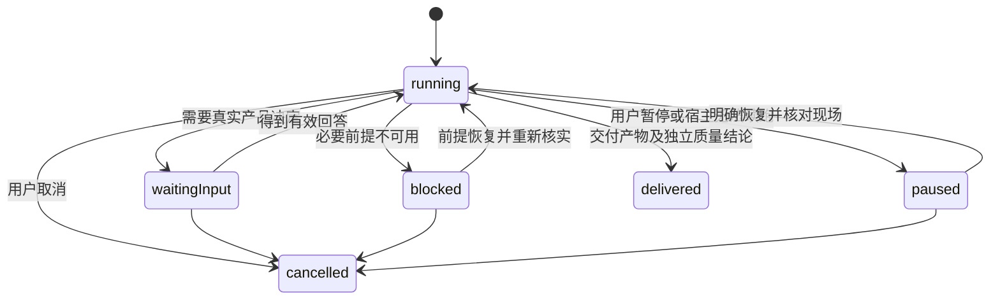

### 3.10 状态、版本与完成判断

任务执行状态和质量结论分开保存：

- 任务执行状态：`running | waiting-input | blocked | paused | delivered | cancelled`。
- 子任务状态：`queued | running | returned | accepted | integrated | failed | abandoned | cancelled`。returned 必须经过主 Agent 验收才变为 accepted；代码类单元完成整合后才记 integrated。
- 检查结果：`PASS | FAIL | NOT_RUN | NOT_APPLICABLE`，另存证据、独立性和原因。检查未执行不能改成 PASS。
- 交付结论：`VERIFIED | PASS_WITH_SKIPS | UNVERIFIED | BLOCKED`，按下方统一判定契约；逐检查 `NOT_RUN` 不等于任务级阻塞。
- 知识影响：`NOT_APPLICABLE | NONE | REVIEW_RECOMMENDED`，另存原因、受影响知识领域和当前产物版本。它只是后续知识审计的优先级信号，不是 `knowledge-audit` 结论。

状态本身不启动工具，也不授予权限。等待输入没有“超时默认批准”；用户说继续，只承接最近明确的目标和范围。

验证记录至少包括目标、验收场景、环境、命令或实际操作、结果、时间、产物版本、执行者及是否独立。Git 产物记录 head 与未提交差异标识；文件产物记录内容哈希。配置和工程包版本也是长任务恢复的输入。

项目有实际变更时，进入 `delivered` 前根据当前差异、设计决定和验证事实做轻量知识影响判断。高信号包括核心模块增删、职责/主链路改变、公共接口/协议/Schema/配置契约改变、构建/部署/测试/运行方式改变、安全权限模型改变、关键领域模型改变、大规模迁移或能力正式废弃/落地。判断不扫描知识库、不主动调用 `nimo-knowledge-audit`、不因 `REVIEW_RECOMMENDED` 阻断交付。长期 program 将结果写入 `knowledgeImpact`；短任务在最终 checkpoint/交付摘要记录需要审计的领域。

修改 head、依赖、基线或运行环境时，识别受影响证据并重新检查。没有变化且能证明适用范围未变的证据可复用，不机械重跑所有检查。patch-id 相同仅支持判断补丁内容等价，不能覆盖基线改变引入的集成风险。

普通任务在会话内保留必要信息即可。长任务每个可验证单元后保存 checkpoint 和决策记录；不要让每条工具调用都变成一段流水账。恢复时先读摘要和相关证据，原始日志按问题查阅。

## 验证判定契约（唯一真源）

逐检查结果保持 `PASS | FAIL | NOT_RUN | NOT_APPLICABLE`。任务级结论由必要检查集合决定：

- `VERIFIED`：必要检查均有有效 PASS，没有未处理失败。
- `PASS_WITH_SKIPS`：至少一项必要检查为 NOT_RUN，且每项必要 NOT_RUN 都有用户明确跳过声明；其他必要检查均为 PASS，没有未处理失败。即使所有必要检查都经声明跳过，也按声明边界放行，不能宣称已经实测。
- `BLOCKED`：必要运行前提不可用且没有适用跳过声明。
- `UNVERIFIED`：其他证据不足或存在未处理失败的情况，不代表验证通过。

跳过声明包含检查 ID、用户声明来源、原因、任务 ID、产物版本和目标环境。当前任务／版本／环境必须匹配，恢复任务时重新核对，不能跨任务或目标环境继承；不得通过后续 NOT_RUN、NOT_APPLICABLE 或跳过声明抹掉尚未由有效 PASS 解决的 FAIL。声明只免除执行，不改变验收预期或授予外部操作权限。缺少声明的 NOT_RUN 不能放行。

Verify、checkpoint、PR 收口和可选 Task Audit 保留同一任务结论。Shipping / autopilot 原样消费 PASS_WITH_SKIPS，与 VERIFIED（映射为 PASS 或 PASS+NOTES）同属测试门禁可放行结论；逐检查事实、声明、版本和环境必须随 verdict 传递。UNVERIFIED / BLOCKED 在 Shipping 中映射为不放行的 FAIL，并保留原始原因。PASS_WITH_SKIPS 可进入连续可放行区间，但不能描述为全部已实测；外部 CI、合并授权和独立验证要求仍单独核对。
